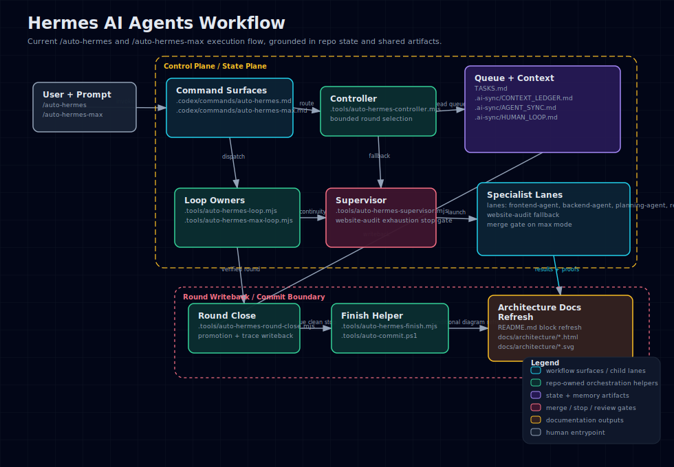
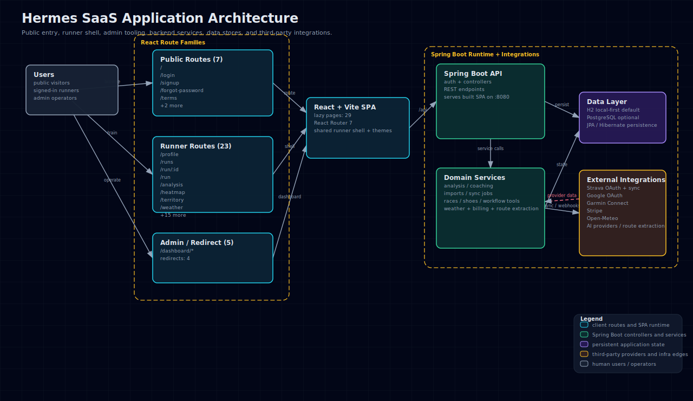

# Hermes — Your Personal Running Coach

> A local-first runner analytics platform. **React** frontend, **Spring Boot** backend.
> Combines daily training guidance, VDOT analysis, heatmaps, race planning, shoe management, and AI-powered import pipelines — all running on your own machine.

---

<a id="toc"></a>

## 📚 Table of Contents · 目录

### English
- [What is Hermes?](#what-is-hermes)
- [First Time Here? Start Here](#first-time-here-start-here)
- [Use the Built-in Mock Account](#mock-account)
- [Project Tour: Where Lives What?](#project-tour)
- [Quick Start (5 minutes)](#quick-start)
- [How to Make Your First Code Change](#first-code-change)
- [Architecture & Tech Stack](#architecture-stack)
- [Feature Highlights](#feature-highlights)
- [Web Routes](#web-routes)
- [Analysis — How It Works](#analysis-how-it-works)
- [Development Workflow](#development-workflow)
- [Database](#database)
- [Login Options](#login-options)
- [AI-Agent Workflow](#ai-agent-workflow)
  - [Choosing the Right /auto-hermes-* Command](#choose-command)
  - [Embedded Skills: When They Help](#skills)
- [Production Setup](#production-setup)
- [Garmin Connect Import](#garmin-connect-import)
- [File Auto-Import (Garmin / COROS)](#file-auto-import)
- [Important Things to Remember](#important)
- [Troubleshooting](#troubleshooting)
- [Regression Checklist](#regression-checklist)
- [Glossary](#glossary)

### 中文
- [Hermes 是什么？](#hermes-是什么)
- [第一次来这里？从这里开始](#新手起点)
- [使用内置模拟账号](#中文-模拟账号)
- [项目导览：哪里放什么？](#项目导览)
- [快速开始（5 分钟）](#中文-快速开始)
- [如何提交第一次代码改动](#第一次代码改动)
- [架构与技术栈](#中文-架构)
- [功能亮点](#中文-功能亮点)
- [Web 路由](#中文-web-路由)
- [分析公式详解](#中文-分析公式)
- [开发流程](#中文-开发流程)
- [数据库](#中文-数据库)
- [登录方式](#中文-登录方式)
- [AI 智能体工作流](#中文-ai-工作流)
  - [如何选择正确的 /auto-hermes-* 命令](#中文-选择命令)
  - [内置技能：什么时候用得上](#中文-技能)
- [生产部署](#中文-生产部署)
- [Garmin Connect 导入](#中文-garmin-导入)
- [文件自动导入（Garmin / COROS）](#中文-文件导入)
- [重要事项](#中文-注意事项)
- [常见问题](#中文-常见问题)
- [回归测试清单](#中文-回归清单)
- [术语表](#中文-术语表)

---

[English](#english) | [中文说明](#中文)

---

<a id="english"></a>

## English

<a id="what-is-hermes"></a>

### What is Hermes?

Hermes is a **personal running coach** you run locally. It analyzes your running data to answer three questions every runner asks:

1. **Should I run today, and how hard?** — Daily readiness, weather, workout blueprint, shoe guidance
2. **Am I improving?** — VDOT tracking, training load (ACWR), race predictions, recovery estimation
3. **Which shoes should I use?** — Shoe inventory, mileage tracking, AI-assisted photo scanning

Hermes works with data from **Strava**, **Garmin Connect**, **COROS**, and manual file imports (FIT/GPX/TCX/ZIP). All analysis stays on your machine.

**Better than Strava?** Hermes earns its place by being smarter (personalized coaching, not social feeds), more actionable (specific pace ranges, not generic recommendations), and more trustworthy (transparent methodology, no hidden algorithms).

---

<a id="first-time-here-start-here"></a>

### First Time Here? Start Here

Welcome. Here is the fastest path from zero to "I understand this project and I've changed something":

1. **Read [What is Hermes?](#what-is-hermes)** — understand what you're building and who it's for. (5 min)
2. **Run [Quick Start](#quick-start)** — get the app live on `localhost:8080`. (5 min)
3. **Walk the [Project Tour](#project-tour)** — learn where every file type lives so you never have to guess. (5 min)
4. **Make your first change** via [How to Make Your First Code Change](#first-code-change) — edit something, see it land. (10 min)
5. **Read [Development Workflow](#development-workflow)** — learn the daily-driver commands for frontend, backend, and testing. (10 min)

**Total: ~35 minutes from clone to "I edited something and saw it live."**

No prior knowledge of Spring Boot, React, or sports science is required to make the first change. Each section below assumes you're arriving for the first time and explains the "why" alongside the "how".

> **First action for new contributors:** Before recording any activities, log in with the **[built-in mock account](#mock-account)** to see every Hermes feature pre-loaded with realistic data. It takes 30 seconds and lets you explore the full app immediately.

---

<a id="mock-account"></a>

### Use the Built-in Mock Account

**Why this matters for a new contributor:** Hermes analyzes *your* running data — but you don't have any yet. The mock account gives you a pre-seeded local runner with shoes and run history, so every page (Profile, Runs, Analysis, Today Run, Shoes) shows real content the moment you log in. No Strava connection, no file imports needed.

> **Credentials at a glance**
>
> Display name: **Hermes Shared Runner**
> Email: `strava+140971747@hermes.local`
> Password: `<set-local-password>`
>
> After login you'll see the dashboard greet you with `早上好, Hermes Shared Runner.` (or `Good morning, Hermes Shared Runner.` in English). If you see a different name, the bootstrap didn't pick up the default — see [How to enable](#how-to-enable) below.

> **Reserved territory rival**
>
> Email: `territory-rival@hermes.local`
> Password: `<set-rival-password>`
>
> This second local-only account is reserved for Territory testing. Its simulated runs intentionally overlap the shared runner's later routes with denser GPS samples, so `/territory` can show real contested/conquered land instead of a single-account happy path. Do not repurpose it for normal demos.

#### How to enable

**Windows** — copy the example env file then start Hermes:

```powershell
Copy-Item Hermes.local.env.example.ps1 Hermes.local.env.ps1
.\start_hermes.bat
```

`start_hermes.bat` reads `Hermes.local.env.ps1` automatically. The file already includes:

```powershell
$env:APP_LOCAL_SHARED_RUNNER_ENABLED      = "true"
$env:APP_LOCAL_SHARED_RUNNER_EMAIL        = "strava+140971747@hermes.local"
$env:APP_LOCAL_SHARED_RUNNER_PASSWORD     = "<set-local-password>"
$env:APP_LOCAL_SHARED_RUNNER_DISPLAY_NAME = "Hermes Shared Runner"
```

Alternatively, set the vars inline without editing any file:

```powershell
$env:APP_LOCAL_SHARED_RUNNER_ENABLED = "true"
.\start_hermes.bat
```

**macOS / Linux** — copy the example env file then start the backend:

```bash
cp .env.example .env
export APP_LOCAL_SHARED_RUNNER_ENABLED=true
cd backend
./mvnw spring-boot:run
```

The relevant lines in `.env.example` (already present):

```bash
APP_LOCAL_SHARED_RUNNER_ENABLED=true
APP_LOCAL_SHARED_RUNNER_EMAIL=strava+140971747@hermes.local
APP_LOCAL_SHARED_RUNNER_PASSWORD=<set-local-password>
APP_LOCAL_SHARED_RUNNER_DISPLAY_NAME=Hermes Shared Runner
```

#### What you get

Once logged in with the mock account you can immediately explore:

| Page | What you'll see |
|---|---|
| `/profile` | Runner Hub with readiness, recent run summary, mileage stats |
| `/runs` | Seeded run history with routes and metrics |
| `/analysis` | VDOT card, ACWR load chart, training paces |
| `/today-run` | Daily coaching recommendation with pace ranges |
| `/shoes` | Pre-loaded shoe inventory with mileage tracking |
| `/territory` | Real conquest conflicts between the shared runner and reserved territory rival |

> **Local-safe.** The mock account is disabled by default and skipped entirely in production. Never use these credentials outside your local machine.

#### For AI-agent contributors

The auto-hermes verification scripts use this account to check auth-walled pages without needing real Strava credentials. Scripts like `.tools/one-shot-muscle-inspect.mjs` and `.tools/one-shot-shoes-add-inspect.mjs` log in as `strava+140971747@hermes.local` via Playwright — this is how the auto-hermes lanes verify that a page works end-to-end after a change.

→ For the full configuration reference and advanced options, see [Local Shared Runner for Contributors](#login-options).

---

<a id="project-tour"></a>

### Project Tour: Where Lives What?

Before you touch code, spend 5 minutes reading this map. It answers "where do I add a new page?", "where do I change copy?", and "where do I add a new API?" in under 30 seconds.

```
Hermes/
│
├── frontend/                    React 19 SPA (Vite, Chart.js, Leaflet)
│   ├── src/pages/               One .jsx file per route — Today, Runs, Analysis, etc.
│   │                            ADD A NEW PAGE: create a file here + register in App.jsx
│   ├── src/components/          Shared UI: TopbarNotifications, AppIcon, charts, modals
│   │                            ADD A SHARED WIDGET: create a component file here
│   ├── src/utils/               Pure helper functions (formatting, math, route helpers)
│   │                            No React imports here — these are plain JS utilities
│   ├── src/i18n/                All user-visible copy lives here
│   │   └── translations.js      Single file with `en` and `zh-CN` keys
│   │                            CHANGE ANY LABEL OR TEXT: edit translations.js
│   ├── src/data/                Static seed data (shoe catalog, etc.)
│   └── src/styles/              style.css — one file. Design tokens at the top.
│
├── backend/                     Spring Boot 4 REST API + serves the built SPA
│   └── src/main/java/com/hermes/backend/
│       ├── controller/          REST endpoints — one controller per domain
│       │                        ADD A NEW API ROUTE: create or edit a controller here
│       ├── service/             Business logic — calculation, orchestration
│       ├── entity/              JPA database entities (maps to DB tables)
│       └── dto/                 Request/response shapes (what the API accepts/returns)
│   └── src/main/resources/
│       └── application.properties   Spring config, H2 path, CORS, JWT settings
│
├── .tools/                      Dev scripts — browser harness, auto-hermes loop engine,
│                                translation checker, codex generator
├── .claude/                     AI agent commands and skills (Claude Code prompts)
├── .codex/                      Mirror for Codex runtime
├── docs/                        Architecture diagrams, setup walkthroughs
├── .ai-sync/                    Cross-agent coordination boards (gitignored where needed)
│
├── TASKS.md                     Shared task queue for AI agents
├── AGENTS.md                    Agent personas, coach-voice rules, engineering standards
├── CLAUDE.md                    Project brain — product vision, stack, conventions
└── README.md                    This file
```

**Quick-answer cheat sheet:**

| Question | Answer |
|---|---|
| Where do I add a new page? | `frontend/src/pages/NewPage.jsx` + route in `frontend/src/App.jsx` |
| Where do I change a button label? | `frontend/src/i18n/translations.js` — find the key, edit both `en` and `zh-CN` |
| Where do I add a new REST endpoint? | `backend/src/main/java/com/hermes/backend/controller/` |
| Where does the database schema live? | `backend/src/main/java/com/hermes/backend/entity/` (JPA entities auto-migrate on start) |
| Where is the main CSS file? | `frontend/src/styles/style.css` |
| Where do I find the app config? | `backend/src/main/resources/application.properties` |

---

<a id="quick-start"></a>

### Quick Start

**Why this matters for a new contributor:** This is your sanity check. If the app runs locally, your environment is set up correctly and you can start making changes.

#### Windows

```powershell
.\start_hermes.bat
```

#### macOS / Linux

```bash
cd backend
./mvnw spring-boot:run
```

Open `http://localhost:8080`, sign up with email, and you're in. No database setup, no API keys, no configuration needed.

> **Want the full experience?** See [Production Setup](#production-setup) for PostgreSQL, Strava/Google OAuth, Stripe billing, and email verification.

---

### Platform-Specific Instructions

Hermes setup instructions are split by platform from now on:

- **Windows users** should use PowerShell examples, `.bat` launchers, and `Hermes.local.env.ps1`.
- **macOS / Linux users** should use Bash/Zsh examples, `./mvnw`, and exported environment variables.
- When adding new setup steps, include both command forms whenever shell syntax differs.

---

<a id="first-code-change"></a>

### How to Make Your First Code Change

**Why this matters for a new contributor:** Reading about a codebase is valuable; editing it cements your mental model. This section walks you through two real examples — one frontend, one backend — so you know exactly what touching the code feels like end-to-end.

#### Example A: Change a Label on the Profile Page (Frontend)

This shows the full frontend loop: find text → edit → run dev server → see it live.

**Step 1 — Find where the label string lives.**

All user-visible text is in `frontend/src/i18n/translations.js`. Open it and search for the phrase you want to change (e.g. "Runner Hub"). You'll see both `en` and `zh-CN` entries. Edit both.

```js
// frontend/src/i18n/translations.js  (simplified excerpt)
en: {
  profile: {
    title: "Runner Hub",      // ← change this
    ...
  }
},
"zh-CN": {
  profile: {
    title: "个人主页",          // ← and this
    ...
  }
}
```

**Step 2 — Start the dev server.**

```bash
cd frontend
npm install    # only needed the first time
npm run dev    # → http://localhost:3000
```

The dev server hot-reloads — save the file and the browser refreshes automatically.

**Step 3 — Verify the change visually.**

Open `http://localhost:3000/profile` and confirm the new label appears in both languages (use the language toggle in Settings).

**Step 4 — Check translations parity.**

```bash
node .tools/check-translations.mjs
```

This script verifies that every key in `en` also exists in `zh-CN` and vice versa. It must exit 0 before any commit involving copy changes.

**Step 5 — Lint the file.**

```bash
cd frontend
.\node_modules\eslint\bin\eslint.js src/i18n/translations.js
```

---

#### Example B: Add a Field to the Runner Profile API Response (Backend)

This shows the full backend loop: find the controller → add a field → compile → test the endpoint.

**Step 1 — Find the controller.**

Open `backend/src/main/java/com/hermes/backend/controller/ProfileController.java`. Locate the method that handles `GET /api/profile` (or similar). It returns a DTO.

**Step 2 — Add the field to the DTO.**

Open the DTO class that method returns (e.g. `ProfileDTO.java` in the `dto/` folder). Add your new field:

```java
// backend/.../dto/ProfileDTO.java
public class ProfileDTO {
    private String displayName;
    private int totalRuns;
    private double totalDistanceKm;
    private String newField;  // ← add this
    // ... getters and setters
}
```

**Step 3 — Compile to catch errors.**

```bash
cd backend
./mvnw -q -DskipTests compile
```

Fix any compilation errors before continuing.

**Step 4 — Run the backend and test the endpoint.**

```bash
cd backend
./mvnw spring-boot:run
```

Once running, test via curl or your browser:

```bash
curl http://localhost:8080/api/profile -H "Authorization: Bearer <your-token>"
```

You should see `newField` in the JSON response.

**Step 5 — Connect it in the frontend (optional).**

The frontend calls this endpoint in `frontend/src/pages/Profile.jsx`. Search for the API call (usually `fetch('/api/profile')` or a helper from `frontend/src/utils/`), then use the new field in the JSX.

---

#### How to Submit Your Change

> **`/auto-hermes-push-main` is the only supported way to open a PR into `main`.**
> Do not `git push origin main` directly, do not run `gh pr create` by hand, do not cherry-pick, rebase, force-push, or merge through any other path. The command runs every required gate, blocks on real failures (secret leak, lint, backend compile, Docker, identity), pushes the current branch, opens the PR, and writes a structured artifact at `.ai-sync/AUTO_HERMES_PUSH_MAIN.{md,json}` so the change is auditable. Bypassing it skips those gates.

Run it from the repo root:

```bash
node .tools/auto-hermes-push-main.mjs --execute --write --message "<type>: <one-line summary>"
```

Or invoke it as a slash command in Claude Code / Codex / Gemini CLI:

```
/auto-hermes-push-main
```

**Commit and PR citation rules** (enforced by the command for AI agents, recommended for humans): every commit title is `<type>: <imperative one-line summary ≤ 70 chars>`, every PR body has `## Summary` (one bullet per touched surface — what changed and why), `## Test plan` (checklist of verification commands you actually ran), and links to `Closes #N` when an issue exists. Cite the touched files inline. Cite browser proof screenshots for UI changes and runtime proof artifacts for backend changes. Never claim "all tests pass" without listing which tests. Full rules: [`.codex/commands/auto-hermes-push-main.md`](.codex/commands/auto-hermes-push-main.md) → *Commit & PR Citation Rules*.

What the command does, in order:

1. Verifies the remote is `https://github.com/520HXC/run.git` and the local git identity matches the values configured in `CLAUDE.md` ("Identity (set before every commit)").
2. Refuses to run when the current branch is `main` itself.
3. Refreshes architecture diagrams (`README.md`, `/auto-hermes` flow, SaaS, AI agents).
4. Runs the static security scan — blocks on secret, PII, API-key, or config leaks.
5. Runs `npm run lint` (frontend) and `./mvnw -q -DskipTests compile` (backend).
6. Runs the Docker / main-repository publish gate.
7. Pushes the current branch to `origin`.
8. Opens a PR into `main` via `gh pr create`.

If any gate fails, the command stops and reports which one. Fix the underlying issue, rerun. Do not bypass with `--skip-checks` unless you are absolutely sure the finding is a false positive AND you can prove it in the PR body.

---

<a id="how-to-sync-from-upstream"></a>

#### How to Sync from Upstream

> **`/auto-hermes-pull-main` is the safe counterpart to `/auto-hermes-push-main`.**
> Use it whenever someone else (or you, on another machine) has pushed commits to `main` and you want them locally without losing your in-progress edits.

Run it from the repo root:

```bash
# Dry-run first — shows what would change, never touches the tree.
node .tools/auto-hermes-pull-main.mjs

# Then pull. Auto-stashes dirty work, fast-forwards on `main`, merges (or
# rebases with --strategy rebase) on a feature branch, and writes an audit
# artifact to `.ai-sync/AUTO_HERMES_PULL_MAIN.{md,json}`.
node .tools/auto-hermes-pull-main.mjs --execute --write
```

Or invoke it as a slash command in Claude Code / Codex / Gemini CLI:

```
/auto-hermes-pull-main
```

What the command does, in order:

1. Verifies the remote is `https://github.com/520HXC/run.git` and refuses to run on a detached HEAD.
2. Runs `git fetch origin --prune` to learn the latest refs without touching the tree.
3. Reports how many commits you're ahead / behind and lists the incoming commits.
4. Picks a strategy: `ff-only` on `main` (no merge commits on the trunk), `merge` (default) or `rebase` (with `--strategy rebase`) on a feature branch.
5. If the tree has uncommitted changes, runs `git stash push -u -m "auto-hermes-pull-main <timestamp>"` first. Pass `--no-stash` to refuse instead.
6. Applies the merge / rebase / fast-forward.
7. On any conflict, **aborts the operation** and **restores your stash** so you're back to where you started. Pass `--allow-conflicts` to leave the tree in the conflicted state for manual resolution.
8. On a clean pull, restores your stash via `git stash pop`. If the pop hits a conflict, the stash is kept on the stack with the exact filename surfaced.

The command never force-pulls, never `git reset --hard`s, and never auto-resolves conflicts.

Typical loop with the matching push command:

```
/auto-hermes-pull-main   # before you start editing
…work, commit…
/auto-hermes-push-main   # when ready to open a PR
```

---

<a id="architecture-stack"></a>

### Architecture & Tech Stack

**Why this matters for a new contributor:** Understanding the two-process architecture prevents a common confusion — the frontend dev server (`:3000`) and the production setup (`:8080`) serve the same React app in different ways.

```
frontend/          React 19 + Vite 8 — dev server on :3000, proxies API calls to :8080
backend/           Spring Boot 4 + JPA — REST API on :8080, serves the built frontend SPA
```

**How the two fit together:**
- In **development**: run `npm run dev` in `frontend/` for hot-reload. The Vite dev server proxies any `/api/...` call to the Spring Boot backend on `:8080`.
- In **production**: run `npm run build` in `frontend/`, which drops the built bundle into `backend/src/main/resources/static/`. Spring Boot then serves both the API and the static files from `:8080`.

#### Stack Table

| Layer | Technology | Why |
|---|---|---|
| Frontend | React 19, React Router 7, Chart.js, Leaflet, Vite 8 | Fast SPA, rich charts, interactive maps |
| Backend | Spring Boot 4, Spring Data JPA, Hibernate | Robust REST API, declarative ORM |
| Database | H2 (zero-config default) or PostgreSQL | Zero setup for dev; production-grade for deploy |
| Auth | JWT sessions, Google OAuth 2.0, Strava OAuth 2.0, email/password + verification, reCAPTCHA v3 | Multiple login paths, no friction for new users; bot protection on signup |
| AI | Gemini 2.5 Flash (shoe image scanning), Qwen (course-map route extraction) | Automates tedious data entry |
| Payments | Stripe Checkout (Pro subscription) | Simple, hosted checkout — no card data on your server |

<!-- AUTO-GENERATED ARCHITECTURE DIAGRAMS START -->
### Live Architecture Diagrams

#### AI Agents Workflow



Source artifact: [docs/architecture/ai-agents-workflow.html](docs/architecture/ai-agents-workflow.html)

#### SaaS Architecture



Source artifact: [docs/architecture/saas-architecture.html](docs/architecture/saas-architecture.html)
<!-- AUTO-GENERATED ARCHITECTURE DIAGRAMS END -->

---

<a id="feature-highlights"></a>

### Feature Highlights

**Why this matters for a new contributor:** Know what the app actually does before you add to it. Each area below is backed by a React page and a set of backend endpoints.

| Area | What you get |
|---|---|
| **Today Run** | Daily coaching: readiness score, weather, personalized workout blueprint, shoe recommendation |
| **Analysis** | VDOT (VO₂max estimate), training paces, effort scores, ACWR injury risk, recovery time, form tracking |
| **Heatmap** | Full-screen GPS heatmap of all your runs with live totals |
| **Runs** | Filterable run log with route maps, performance metrics, and drill-down detail |
| **Shoes** | Inventory with mileage tracking, rotation insight, AI photo scan import, catalog browser |
| **Races** | Interactive world map, 60+ race catalog, personal bests, countdowns, race-specific training |
| **Schedule** | Weekly training planner |
| **Import** | Strava sync, Garmin Connect pull, manual FIT/GPX/TCX/ZIP (including COROS and Huawei Health) |
| **Settings** | Theme (light/midnight), language (en/zh-CN), units, connected services, batch import |

---

<a id="ai-agent-workflow"></a>

### AI-Agent Workflow

**Why this matters for a new contributor:** Hermes ships with an AI-agent loop that picks tasks from a shared queue, implements them with specialist sub-teams, verifies, and promotes follow-up work. If you want to understand how the codebase evolves, or how to contribute AI-assisted improvements, this is the system to understand.

Hermes includes an AI-agent workflow driven by **Claude Code** and **Gemini CLI** for autonomous development. The agents pick tasks from a shared queue, implement them with specialist sub-teams, verify, and promote follow-up work.

<a id="choose-command"></a>

#### Choosing the Right /auto-hermes-* Command

Use this table to decide which command to run. All commands read `TASKS.md` as their shared task queue.

| If you want to… | Use this command | What happens |
|---|---|---|
| Pick up the next task from `TASKS.md`, single-thread, with verification gates | `/auto-hermes` | Reads `TASKS.md`, picks the highest-priority item, runs PM → Builder → Reviewer → Tech-Debt-Reviewer with verification at each step. Stops after one bounded round. |
| Keep iterating until everything's done | `/auto-hermes-self` | Same as `/auto-hermes` but doesn't stop on a successful round. Loops through the queue and self-promotes follow-ups until the queue is exhausted, a human-loop gate fires, or context pressure hits. Use for "drive it home overnight". |
| Spin up specialists in parallel for one big feature with disjoint owned files | `/auto-hermes-max` | Decomposes the work into lanes (frontend / backend / tests / etc.), spawns one specialist per lane in parallel, then runs a merge gate to reconcile. Good for cross-stack features. |
| Find tech debt across the codebase | `/auto-hermes-tech-debt` | Audits the repo and writes findings as bounded tasks into `TASKS.md`. |
| Run a security audit | `/auto-hermes-security` | Sweeps auth, OAuth, billing, webhooks, and admin surfaces. |
| Smoke-test resilience (auth expired, weather outage, malformed file) | `/auto-hermes-attack` | Synthetic failure-mode probe — non-destructive. |
| Research running-shoe brands/series and update the catalog | `/auto-hermes-find-shoe` | Web search → series-level catalog additions. |
| Polish frontend copy so the product sounds coach-like, not AI-generic | `/auto-hermes-language` | Routes UI copy through coach-voice review with zh-CN/en sync enforced. |
| Push the branch and open a PR into `github.com/520HXC/run` | `/auto-hermes-push-main` | **The only supported PR path.** Full gates (security scan, lint, compile, Docker, identity), then push + PR. Direct `git push origin main`, manual `gh pr create`, cherry-picks, and force-pushes are not allowed. See [How to Submit Your Change](#how-to-submit-your-change). |
| Apply Hermes UI standards to one specific surface | `/frontend-design` | Loads the frontend-design skill and Hermes design tokens, then runs a single bounded UI round. |
| Generate a minimal working brief before broad execution | `/optimize-context` | Writes `.ai-codex/optimized-claude.md` with the smallest useful context slice. Saves tokens for the actual round. |
| Cap response token count for tight sessions | `/caveman` | Switches the session into terse mode (`lite` by default). |

##### Argument vs. self-loop mode

Most commands accept an optional argument that becomes the concrete task scope:

- **With an argument** — `/auto-hermes Add a tooltip to the VDOT card on /analysis` — the command works on exactly that scope and stops after one bounded round.
- **Without an argument** — `/auto-hermes` — the command enters self-loop mode and picks the next item from `TASKS.md`.

##### Three first-time examples

**1. Add a button to the Profile page**

```
/auto-hermes Add a Strava reconnect button to /profile that calls POST /api/auth/strava/reconnect.
```

What happens: Claude reads the task scope → PM picks the frontend-only surface → Builder lane edits `Profile.jsx` and the backend controller → frontend runtime proof gate runs (`verify-frontend-runtime-sync.mjs`) → Reviewer signs off. One bounded round, stops cleanly.

**2. Audit and fix accessibility on /today-run**

```
/auto-hermes-self Run accessibility audit on /today-run and fix any contrast or aria-label issues.
```

What happens: First round audits the page and writes findings into `TASKS.md`. The self-loop immediately picks the first finding as the next task, fixes it, verifies, and continues until the queue is empty. No manual "go again" needed.

**3. Add a new metric across the stack**

```
/auto-hermes-max Add a 'sleep score' field that the backend exposes and Today Run renders next to readiness.
```

What happens: `/auto-hermes-max` decomposes the work into disjoint lanes — one agent owns the JPA entity + controller, another owns `TodayRun.jsx` + translations. They run in parallel, write results to `.ai-sync/auto-hermes-max-results/`, then the merge gate reconciles and runs lint + compile. Result: a full-stack change in roughly one wall-clock round.

#### Setup

1. Install the CLI tools:
   ```bash
   npm install -g @anthropic-ai/claude-code
   npm install -g @google/gemini-cli
   ```
2. Configure local secrets for your platform.

   Windows:
   ```powershell
   Copy-Item Hermes.local.env.example.ps1 Hermes.local.env.ps1
   notepad Hermes.local.env.ps1
   ```

   macOS / Linux:
   ```bash
   cp .env.example .env
   ${EDITOR:-nano} .env
   ```

#### Slash Commands - Native After Clone

The `/auto-hermes-*` commands ship inside this repository at [.claude/commands/](.claude/commands/) for Claude Code and [.codex/commands/](.codex/commands/) as the versioned Codex source. Claude Code discovers project commands from the checkout. Codex native `/` autocomplete is installed by mirroring the Codex sources into `$CODEX_HOME\prompts` and `$CODEX_HOME\commands`:

```powershell
powershell -ExecutionPolicy Bypass -File .tools/install-hermes-codex-commands.ps1 -SkipWsl
```

Verify after a fresh clone:

```bash
git clone https://github.com/520HXC/run.git Hermes
cd Hermes
claude            # launches Claude Code in the Hermes directory
```

Once Claude Code is running, type `/` and look for the `auto-hermes` family in the autocomplete dropdown, or run `/help` to list every project command. Each entry shows the one-line `description:` from the command's frontmatter.

##### Which commands are Claude-native vs Codex-native

Not every command exists for both CLIs. Use this table to pick the right tool:

| Command | Claude Code | Codex native source |
|---|---|---|
| `/auto-hermes` | ✅ [.claude/commands/auto-hermes.md](.claude/commands/auto-hermes.md) | ✅ [.codex/commands/auto-hermes.md](.codex/commands/auto-hermes.md) |
| `/auto-hermes-self` | ✅ [.claude/commands/auto-hermes-self.md](.claude/commands/auto-hermes-self.md) | ✅ [.codex/commands/auto-hermes-self.md](.codex/commands/auto-hermes-self.md) |
| `/auto-hermes-max` | ✅ | ✅ |
| `/auto-hermes-attack` | ✅ | ✅ |
| `/auto-hermes-market` | ✅ | ✅ |
| `/auto-hermes-tech-debt` | ✅ | ✅ |
| `/auto-hermes-push-main` | — (run via Codex / Gemini, **or** `node .tools/auto-hermes-push-main.mjs --execute --write --message "<msg>"` from any shell) | ✅ [.codex/commands/auto-hermes-push-main.md](.codex/commands/auto-hermes-push-main.md) |
| `/auto-hermes-pull-main` | ✅ [.claude/commands/auto-hermes-pull-main.md](.claude/commands/auto-hermes-pull-main.md) | ✅ [.codex/commands/auto-hermes-pull-main.md](.codex/commands/auto-hermes-pull-main.md) |
| `/auto-hermes-security` | — (run via Codex, or `node .tools/auto-hermes-security.mjs`) | ✅ [.codex/commands/auto-hermes-security.md](.codex/commands/auto-hermes-security.md) |
| `/auto-hermes-find-shoe` | — | ✅ [.codex/commands/auto-hermes-find-shoe.md](.codex/commands/auto-hermes-find-shoe.md) |
| `/auto-hermes-language` | — (use `/auto-hermes Polish coach-voice copy on <surface>`) | ✅ [.codex/commands/auto-hermes-language.md](.codex/commands/auto-hermes-language.md) |
| `/auto-hermes-structure-update` | — (run via `node .tools/auto-hermes-structure-update.mjs`) | ✅ [.codex/commands/auto-hermes-structure-update.md](.codex/commands/auto-hermes-structure-update.md) |
| `/auto-hermes-submit-main` | — | ✅ [.codex/commands/auto-hermes-submit-main.md](.codex/commands/auto-hermes-submit-main.md) |

If you need a Claude-native version of a Codex-only command (for example, to run `/auto-hermes-push-main` directly inside Claude Code), copy the matching file across:

```bash
cp .codex/commands/auto-hermes-push-main.md .claude/commands/auto-hermes-push-main.md
# Then either restart Claude Code, or type `/` and the new command will appear.
```

The `.gitignore` whitelists every `.claude/commands/*.md` and `.codex/commands/*.md`, so a newly-added command is committable and survives the next `git clone`.

##### Making `/auto-hermes-*` work outside this repo (optional)

Project commands only load when Claude Code is launched inside the Hermes directory. If you want the same commands available **everywhere** (for cross-repo work or quick experiments), copy them into Claude Code's user-level directory:

Windows (PowerShell):
```powershell
$dest = Join-Path $HOME ".claude\commands"
New-Item -ItemType Directory -Force -Path $dest | Out-Null
Copy-Item .claude\commands\auto-hermes*.md $dest
```

macOS / Linux:
```bash
mkdir -p "$HOME/.claude/commands"
cp .claude/commands/auto-hermes*.md "$HOME/.claude/commands/"
```

Be aware: the global copies still reference Hermes-specific scripts under `.tools/` and Hermes-specific files like `TASKS.md`. They only work end-to-end when the current working directory is a Hermes checkout. Treat global installation as a convenience for autocomplete, not a way to run the workflow against unrelated codebases.

##### Optional skills not shipped with the repo

`git clone Hermes` already gives you **every workflow command** (`/auto-hermes`, `/auto-hermes-pull-main`, `/auto-hermes-push-main`, `/auto-hermes-self`, `/auto-hermes-max`, `/auto-hermes-tech-debt`, etc.) **and the auto-triggered skills they depend on** (`frontend-design`, `translation-sync`, `ui-ux-pro-max`, `loop-mode`, `handoff-state`, plus all 20+ Codex skills under `.codex/skills/`). The standard workflow is fully self-contained — no install required.

The only things **not** in the repo are a small set of **explicit-call-only** skills. They never auto-fire inside `/auto-hermes`; you only miss them if you try to invoke one by name. Install them only if you actually want to type their slash command.

| Skill | What it does | Why it isn't shipped |
|---|---|---|
| `taste-soft`, `taste-brutalist`, `taste-minimalist`, `taste-redesign`, `taste-image-to-code`, `taste-stitch`, `taste-output`, `taste-gpt`, `taste-skill` | Visual-style sub-skills for direct calls like `/taste-soft redesign /profile`. | Upstream community skills with their own licensing — copy them from another Hermes contributor's `~/.claude/skills/` rather than redistributing. |
| `mem0` | Wraps the `mem0`-backed cross-session memory bridge at `.tools/mem0-bridge.mjs`. The bridge code IS shipped; this is just the SKILL.md that documents when an agent should call it. | The bridge no-ops gracefully without an API key, so the skill is optional. |
| `auto-hermes-language` | Sub-skill for coach-voice copy polish. | Most users invoke this as `/auto-hermes Polish coach-voice copy on <surface>` instead — same result. |

###### How to install the Taste sub-skills

The Taste sub-skills are user-level (they apply across every project, not just Hermes). If a current Hermes contributor has them, the fastest path is to copy the directories from their `~/.claude/skills/` to yours. There's no public package: each `SKILL.md` is a hand-written Markdown prompt with frontmatter (`name`, `description`).

Windows (PowerShell), assuming a contributor shared a zip:
```powershell
$dest = Join-Path $HOME ".claude\skills"
New-Item -ItemType Directory -Force -Path $dest | Out-Null
Expand-Archive -Path .\taste-skills-bundle.zip -DestinationPath $dest
```

macOS / Linux:
```bash
mkdir -p "$HOME/.claude/skills"
unzip taste-skills-bundle.zip -d "$HOME/.claude/skills/"
```

If you don't have a bundle, you can write a new sub-skill yourself:

```bash
mkdir -p "$HOME/.claude/skills/taste-yourstyle"
cat > "$HOME/.claude/skills/taste-yourstyle/SKILL.md" <<'EOF'
---
name: taste-yourstyle
description: One-line trigger description. Use only when the user directly names or calls /taste-yourstyle.
---

# Your design style guide
# Bullet rules, banned patterns, required tokens, etc.
EOF
```

Restart Claude Code; `/taste-yourstyle` will appear in autocomplete.

###### How to enable `mem0` (optional cross-session memory)

The bridge is already at `.tools/mem0-bridge.mjs`. To turn it on:

```bash
# 1. Get an API key from https://mem0.ai (free tier exists).
export MEM0_API_KEY="<your key>"

# 2. Optional: self-hosted endpoint.
export MEM0_BASE_URL="https://api.mem0.ai"
```

Without `MEM0_API_KEY` the bridge silently no-ops — every memory call returns `{ "skipped": true }` and the agent continues. Set the key only if you want durable per-agent memory across sessions.

If you want the SKILL.md prompt (to teach Claude Code when to invoke the bridge), drop a one-paragraph file at `~/.claude/skills/mem0/SKILL.md` describing the bridge's trigger conditions — see the `mem0` skill block earlier in this README for a copy-paste-able example.

###### How to enable the Claude-native `/auto-hermes-push-main` slash command

The slash command file lives in `.codex/commands/`. For Claude Code, copy it across (this is also covered above, but worth repeating in the install context):

```bash
cp .codex/commands/auto-hermes-push-main.md .claude/commands/auto-hermes-push-main.md
```

Or just run the underlying helper from any shell without the slash command:

```bash
node .tools/auto-hermes-push-main.mjs --execute --write --message "<type>: <summary>"
```

Both invoke the same logic.

##### Troubleshooting "command not found"

| Symptom | Likely cause | Fix |
|---|---|---|
| `/auto-hermes` not in autocomplete | Claude Code was launched outside the Hermes directory | `cd Hermes && claude` |
| Command appears but errors on step 0 | Missing Node.js (the loop scripts under `.tools/` are `.mjs`) | Install Node 18+ and retry |
| Command runs but lane scripts fail | Missing local env file | Re-run step 2 above (`Hermes.local.env.ps1` on Windows, `.env` on macOS / Linux) |
| Adding a new `auto-hermes-*` command, `git add` silently skips it | An older `.gitignore` allowlist | Pull latest `main` — the gitignore now allows `.claude/commands/*.md` and `.codex/commands/*.md` |

#### Claude Code Commands

| Command | What it does |
|---|---|
| `/auto-hermes` | Standard dev loop — picks a task, implements, verifies |
| `/auto-hermes-self` | Ralph-style indefinite self-loop — keeps executing until a real stop gate fires |
| `/auto-hermes-max` | Parallel multi-agent round with merge gate |
| `/auto-hermes-tech-debt` | Codebase-wide tech debt audit |
| `/auto-hermes-security` | Security audit across auth, config, runtime, and code surfaces |
| `/auto-hermes-market` | Parallel market research + SEO lane → verified opportunities |
| `/auto-hermes-attack` | Resilience/breakage simulation for high-risk surfaces |
| `/auto-hermes-structure-update` | Structure improvement pass |
| `/auto-hermes-find-shoe` | Web-research running shoe brands and update the catalog |
| `/auto-hermes-language` | Polish frontend copy to coach-voice (zh-CN/en sync enforced) |
| `/auto-hermes-push-main` | **The only supported PR path** — guarded publish to `github.com/520HXC/run`. Runs security scan, lint, compile, Docker gate, pushes the branch, opens the PR. No manual `git push`, `gh pr create`, cherry-picks, or force-pushes. |
| `/auto-hermes-pull-main` | **Safe sync from upstream.** Auto-stashes dirty work, fetches `origin`, fast-forwards `main` (or merges/rebases a feature branch), restores stash. Aborts cleanly on conflict — never auto-resolves. Counterpart to `/auto-hermes-push-main`. See [How to Sync from Upstream](#how-to-sync-from-upstream). |
| `/auto-hermes-submit-main` | Backup-first cherry-pick from nested repo |
| `/auto-ship` | Run TASKS.md queue with shared git policy |
| `/deploy` | Prepare Hermes for deployment |
| `/fix-issue` | Fix a GitHub issue |
| `/pr-review` | Review pull request changes |
| `/frontend-design` | Apply Hermes UI design standards |
| `/optimize-context` | Generate minimal working brief before broad execution |
| `/caveman` | Low-token response mode |

#### Key Files for AI Agents

| File | Purpose |
|---|---|
| `TASKS.md` | Shared task queue — check what agents are working on or add new tasks |
| `.ai-sync/CONTEXT_LEDGER.md` | Durable surface-level decisions and context capsules |
| `.ai-sync/AGENT_SYNC.md` | Cross-agent coordination board |
| `AGENTS.md` | Agent personas, coach-voice rules, engineering standards |
| `CLAUDE.md` | Project brain — product vision, stack, conventions |

---

<a id="skills"></a>

### Embedded Skills: When They Help

Skills are bundles of expert knowledge — Markdown prompt files at `.claude/skills/<name>/SKILL.md` — that Claude Code loads on demand. They auto-trigger from the workflow commands (for example, `/auto-hermes` triggers `frontend-design` when the round touches a UI surface), or you can invoke them by name directly in a prompt: `use the taste-soft skill to redesign /profile`.

Authority order: Hermes runtime proof > approved live surface > the skill's recommendations. A skill never overrides a layout the user has already accepted.

To inspect any skill yourself:
```bash
ls .claude/skills/<name>/        # shows SKILL.md plus any helper files
cat .claude/skills/<name>/SKILL.md   # shows the full prompt the skill loads
```

#### Frontend design skills

These are the skills the user called out specifically — use them when the default output looks cheap, crowded, or AI-generic.

| Skill | Best for | Try it like |
|---|---|---|
| `frontend-design` | Default Hermes UI work. Loads Hermes-specific design tokens, coach-voice copy rules, and mobile-first conventions. Auto-triggers on every UI round. | `/frontend-design Make the AnalysisInsightDetail page feel less crowded.` |
| `taste-skill` | Senior UI/UX baseline. Strict metric-based rules, component architecture, hardware-accelerated CSS. Good "first pass" tasteful default. | `Apply taste-skill to /shoes/add and clean up the empty-state copy.` |
| `taste-soft` | High-end agency look — premium fonts, generous spacing, gentle shadows, subtle motion. Use when "the AI version looks cheap". | `Apply taste-soft to the Landing hero so it stops looking generic.` |
| `taste-minimalist` | Clean editorial look. Warm monochrome, flat bento grids, no gradients, no heavy shadows. Use for content-heavy pages. | `Apply taste-minimalist to the Race Center grid.` |
| `taste-brutalist` | Swiss-typographic + military-terminal look. Rigid grid, extreme contrast. Good for data-dense dashboards or editorial portfolios. | `Apply taste-brutalist to /dashboard/audit.` |
| `taste-redesign` | Upgrade an existing surface to "premium" without breaking it. Audits → identifies AI-generic patterns → fixes. | `Use taste-redesign on /profile to upgrade the daily summary card.` |
| `taste-image-to-code` | Image-first workflow. Generates a reference image, analyzes it, then writes code to match. Best when "make it look like the photo I shared". | `Use taste-image-to-code with reference task-images/ref.jpg to redesign /today-run.` |
| `taste-stitch` | Generates `DESIGN.md` files that enforce premium design standards (used downstream by other tools). | `Generate a DESIGN.md for /races using taste-stitch.` |
| `taste-output` | Enforces complete, unabridged code generation. Bans placeholder patterns. Apply when long-output truncation is a problem. | `Use taste-output to rewrite the full Schedule.jsx without truncation.` |
| `taste-gpt` | Elite UX/UI + advanced GSAP motion. Use only for highly directed premium web experiences with heavy animation. | `Use taste-gpt for the landing-page hero scroll experience.` |
| `ui-ux-pro-max` | UI/UX design intelligence — 50+ styles, 161 palettes, 57 font pairings, 99 UX guidelines. Big lookup library. Auto-triggers at the PM lock step before a frontend round. | (auto-triggers; or `Use ui-ux-pro-max to suggest a dark-mode palette.`) |
| `vercel-react-best-practices` | Vercel's React + Next.js performance guidance translated to the Vite stack. Use for rerender bugs, hydration issues, and bundle-shape decisions. | `Use vercel-react-best-practices to audit Profile.jsx for unnecessary rerenders.` |

#### Workflow skills

| Skill | Best for |
|---|---|
| `loop-mode` | Low-token `TASKS.md` execution. Auto-fires when `/auto-hermes-self` or `/auto-hermes` enters queue mode. |
| `handoff-state` | Write a compact resume-checkpoint when another agent should pick up later. |
| `mem0` | Persist durable per-agent memory across sessions (e.g. attack-simulator remembers prior findings). |
| `translation-sync` | Keep zh-CN and en in parity. Auto-fires on any UI copy change. |
| `define-problem-fix-auto` | When the user gives a vague "fix this", load this skill to extract a precise problem statement first. |
| `plays-role-senior-engineer` | Forces senior-engineer tone — asks "is this the right thing to build?" before "is the code correct?". |

#### Output style skills

| Skill | Best for |
|---|---|
| `caveman` | Terse low-token responses. Default level is `lite`. Apply when usage or server pressure makes shorter replies useful. |
| `auto-hermes-push-main` | Guarded publish workflow — runs all gates, pushes, opens a PR. Auto-triggers from `/auto-hermes-push-main`. |

---

<a id="web-routes"></a>

### Web Routes

**Why this matters for a new contributor:** Each row here maps to a React page file in `frontend/src/pages/` and (for protected routes) a set of backend endpoints. Use this table to quickly find which file owns which URL.

| Route | Page | Description |
|---|---|---|
| `/` | Landing | Public homepage with sign-in, sign-up, Strava start |
| `/login` | Login | Email/password + Strava + Google OAuth |
| `/signup` | Signup | Email/password + OAuth entry points + email verification |
| `/terms`, `/privacy` | Legal | Public legal pages |
| `/admin` | Admin Login | System administrator sign-in |
| `/dashboard` | Admin Dashboard | Ops status, KPI grid, runner management, job queues, audit log |
| `/profile` | Runner Hub | Readiness, metrics, records, imports, quick links |
| `/runs` | Run History | Filterable, sortable, paginated run log |
| `/run/:id` | Run Detail | Route map, performance metrics, route intelligence |
| `/analysis` | Analysis | Insight cards, VDOT, training paces, ACWR, recovery |
| `/analysis/vo2max` | VO₂ Max Detail | Trend drill-down |
| `/analysis/:insightKey` | Insight Detail | Injury risk, intensity, coach insight, load balance |
| `/prediction/:distKey` | Prediction Detail | Distance-specific race prediction |
| `/heatmap` | Heatmap | Full-screen GPS heatmap with live totals |
| `/today-run` | Today Run | Daily coaching: readiness, weather, workout, shoes |
| `/shoes` | Shoes | Inventory, rotation insight, filters, scan/import |
| `/shoes/add` | Add Shoes | Guided add-shoes flow |
| `/shoe-catalog` | Shoe Catalog | Browse shoe database |
| `/races` | Race Center | Discovery, countdowns, PBs, saved races |
| `/schedule` | Schedule | Weekly training planner |
| `/muscle-training` | Muscle Training | Anatomical figure, session planning, log |
| `/rewards` | Rewards | Achievement badges, progression |
| `/settings` | Settings | Theme, language, units, Strava, Garmin, imports |

---

<a id="analysis-how-it-works"></a>

### Analysis — How It Works

**Why this matters for a new contributor:** Before you touch the analysis code, understand what each number means. These formulas are the scientific backbone of every coaching recommendation. All come from Jack Daniels' *Running Formula* and peer-reviewed sports science. Hermes shows its work — every number has a traceable basis.

#### VDOT (Daniels' VO₂max Estimate)

VDOT is a single number that captures your current aerobic fitness, derived from a recent race performance. A higher VDOT means faster paces. Hermes uses it to compute all training zones.

From a race performance (distance in meters, time in minutes):

```
velocity     = distance / time                              (m/min)
VO₂          = -4.60 + 0.182258 × v + 0.000104 × v²        (ml/kg/min)
%VO₂max      = 0.8 + 0.1894393 × e^(-0.012778 × t) + 0.2989558 × e^(-0.1932605 × t)
VDOT         = VO₂ / %VO₂max
```

**Current VDOT**: Uses performances from the last **90 days**, prefers distances ≥3 km, takes the **mean of the top three** VDOT values.

#### Training Paces (from VDOT)

| Zone | %VO₂max | Purpose |
|---|---|---|
| Easy | 54–62% | Aerobic base, recovery |
| Marathon | 78% | Race-specific endurance |
| Threshold | 85% | Lactate clearance |
| Interval | 96% | VO₂max stimulus |
| Repetition | 111% | Speed and economy |

#### Training Load — ACWR

ACWR (Acute:Chronic Workload Ratio) is your injury risk meter. It compares your recent training load (last 7 days) to your long-term load (last 28 days). A sudden spike — training much harder than your baseline — predicts injury.

EWMA-based injury risk tracking (Gabbett 2016, Hulin et al. 2014, Williams et al. 2017):

```
Acute  λ = 2/(7+1) = 0.25   (7-day)
Chronic λ = 2/(28+1) = 0.069 (28-day)
ACWR = Acute EWMA / Chronic EWMA
```

| ACWR | Zone | Meaning |
|---|---|---|
| < 0.80 | Under-training | Not enough stimulus |
| 0.80–1.30 | Sweet spot | Optimal loading |
| 1.30–1.50 | Warning | Elevated injury risk |
| > 1.50 | Danger | Reduce load |

#### Effort Score

```
intensityRatio = vo₂Fraction / 0.85
effortScore    = duration_hours × intensityRatio² × 100
```

`vo₂Fraction` derived from heart rate or pace. Threshold runs score ~100/hour.

#### Recovery Estimation

```
durationFactor  = (duration > 90 min) ? 1 + 0.005 × (duration - 90) : 1.0
adjustedScore   = effortScore × durationFactor
baseHours       = 0.45 × adjustedScore^0.85
fitnessDiscount = max(0.80, 1.10 - VDOT / 200)
recoveryHours   = min(96, baseHours × fitnessDiscount)
```

Fitter runner (higher VDOT) → faster recovery. Long runs (>90 min) add penalty. Cap: 96 hours.

#### Daniels' Training Zones

| Zone | VO₂ Fraction | Label |
|---|---|---|
| Recovery | < 59% | Easy recovery jog |
| Easy | 59–75% | Aerobic base |
| Marathon | 75–83% | Marathon pace |
| Threshold | 83–92% | Tempo / lactate threshold |
| Interval | 92–105% | VO₂max intervals |
| Repetition | > 105% | Sprint / economy |

---

<a id="production-setup"></a>

### Production Setup (PostgreSQL + OAuth + Admin)

**Why this matters for a new contributor:** The default H2 database is file-backed and single-user — fine for local development, not suitable for a deployed server. This section covers what to configure when you're deploying Hermes for real use or a multi-user environment.

#### Windows

```powershell
.\start_hermes_postgres.ps1
```

`start_hermes_postgres.ps1` is the main launcher. It loads secrets from `Hermes.local.env.ps1`.

#### macOS / Linux

```bash
export APP_DB_URL='jdbc:postgresql://localhost:5432/hermes'
export APP_DB_USERNAME='hermes'
export APP_DB_PASSWORD='<your-password>'
export STRAVA_CLIENT_ID='<your-strava-client-id>'
export STRAVA_CLIENT_SECRET='<your-strava-client-secret>'
export APP_DATA_ENCRYPTION_KEY='<long-random-hex-key>'
cd backend
./mvnw spring-boot:run
```

Use `.env` only when your shell, IDE, or process manager explicitly loads it before starting Spring Boot. See [docs/setup.md](docs/setup.md) for the canonical variable reference.

#### Core Configuration

| Section | Variables | Purpose |
|---|---|---|
| Database | `APP_DB_URL`, `APP_DB_USERNAME`, `APP_DB_PASSWORD` | PostgreSQL connection |
| Strava OAuth | `STRAVA_CLIENT_ID`, `STRAVA_CLIENT_SECRET`, `STRAVA_REDIRECT_URI`, `APP_DATA_ENCRYPTION_KEY` | Strava login + activity sync |
| Google OAuth | `APP_GOOGLE_CLIENT_ID`, `APP_GOOGLE_CLIENT_SECRET`, `APP_GOOGLE_REDIRECT_URI` | Google login |
| Admin | `APP_BOOTSTRAP_ADMIN_EMAIL`, `APP_BOOTSTRAP_ADMIN_PASSWORD` | Admin account created on startup |
| reCAPTCHA v3 | `RECAPTCHA_SECRET_KEY`, `RECAPTCHA_SITE_KEY` | Google reCAPTCHA v3 bot protection on signup |

#### Stripe Billing (optional)

Sell **Pro** (AI scan quota) via Stripe Checkout.

1. Create a **Product** with a one-time **Price** in [Stripe Dashboard](https://dashboard.stripe.com/)
2. Set `STRIPE_PRICE_PRO_MONTHLY` to the Price ID (`price_...`)
3. Set `STRIPE_SECRET_KEY` (API key) and `STRIPE_WEBHOOK_SECRET` (webhook signing secret)
4. Set `APP_PUBLIC_BASE_URL` to your site URL (e.g. `https://app.example.com`)
5. Optionally set `APP_BILLING_PRICE_LABEL` (e.g. `$9/month`)

Local testing: `stripe listen --forward-to localhost:8080/api/billing/webhook`

#### Email Verification

Email/password sign-up sends a verification link via SMTP. Leave `SPRING_MAIL_HOST` empty on dev to skip verification.

| Variable | Purpose |
|---|---|
| `SPRING_MAIL_HOST` | SMTP server (empty = skip verification) |
| `SPRING_MAIL_PORT` | Usually `587` |
| `SPRING_MAIL_USERNAME` / `SPRING_MAIL_PASSWORD` | SMTP credentials |
| `APP_MAIL_FROM` | From address |
| `APP_PUBLIC_BASE_URL` | Used in verification link |

#### Public Cloud Security Checklist

- **`HERMES_ENV=production`** — Requires `STRAVA_WEBHOOK_VERIFY_TOKEN` set to a long random value
- **TLS** — Terminate HTTPS at reverse proxy. Set `APP_ENABLE_HSTS=true` only when all traffic is HTTPS
- **Reverse proxy** — `server.forward-headers-strategy=framework` is set; configure proxy to send `X-Forwarded-*`
- **CORS** — Set `APP_CORS_ALLOWED_ORIGINS` if frontend is on a different origin
- **Database** — Use PostgreSQL in production; never expose H2 to the network
- **Webhooks** — Strava/Garmin rate-limited per IP; Garmin callback restricted to `*.garmin.com`; Stripe uses signature verification
- **Anti-bot** — Signup is protected by reCAPTCHA v3. Set `RECAPTCHA_SECRET_KEY` + `RECAPTCHA_SITE_KEY` from the [reCAPTCHA admin console](https://www.google.com/recaptcha/admin); `HERMES_ENV=production` fails fast without both keys, while local development skips reCAPTCHA when it is not configured.
- **Errors** — Default error pages omit stack traces; use `APP_JPA_DDL_AUTO=validate` + migrations for mature deployments

---

<a id="development-workflow"></a>

### Development Workflow

**Why this matters for a new contributor:** These are the exact commands you'll run every day. Bookmark this section.

#### Prerequisites

- **Java 17+** — [Adoptium Temurin 17 LTS](https://adoptium.net) recommended
- **Node.js 18+** — [nodejs.org](https://nodejs.org)

#### Frontend Dev

Windows:

```powershell
cd frontend
npm install
npm run dev        # → http://localhost:3000 (hot reload, proxies API to :8080)
```

macOS / Linux:

```bash
cd frontend
npm install
npm run dev        # http://localhost:3000 (hot reload, proxies API to :8080)
```

#### Build for Production

Windows:

```powershell
cd frontend
npm run build      # → backend/src/main/resources/static/
```

macOS / Linux:

```bash
cd frontend
npm run build      # backend/src/main/resources/static/
```

#### Backend

Windows:

```powershell
cd backend
.\mvnw.cmd spring-boot:run        # http://localhost:8080
.\mvnw.cmd test                   # run tests on Windows
.\mvnw.cmd -q -DskipTests compile # compile check on Windows
```

macOS / Linux:

```bash
cd backend
./mvnw spring-boot:run            # http://localhost:8080
./mvnw test                       # run tests
./mvnw -q -DskipTests compile     # compile check
```

#### Translation Parity Check

Run this after **any** user-visible copy change. Exit 0 required before commit.

```bash
node .tools/check-translations.mjs        # parity only
node .tools/check-translations.mjs --all  # + bypass scan
```

---

<a id="database"></a>

### Database

**Why this matters for a new contributor:** You don't need to set up anything for local development — H2 creates a file automatically. Switch to PostgreSQL when you're deploying or want to match production.

#### H2 (default)

Zero config. Database file created at `backend/hermes_db_v2.mv.db`.

#### PostgreSQL

Windows:

```powershell
$env:APP_DB_URL      = "jdbc:postgresql://localhost:5432/hermes"
$env:APP_DB_USERNAME = "hermes"
$env:APP_DB_PASSWORD = "<your-password>"
.\start_hermes.bat
```

macOS / Linux:

```bash
export APP_DB_URL='jdbc:postgresql://localhost:5432/hermes'
export APP_DB_USERNAME='hermes'
export APP_DB_PASSWORD='<your-password>'
cd backend
./mvnw spring-boot:run
```

#### Migrate H2 → PostgreSQL

```powershell
.\migrate_h2_to_postgres.bat
```

For macOS / Linux, use the PostgreSQL env block above and run the backend against PostgreSQL directly. The current migration helper is Windows-only.

---

<a id="login-options"></a>

### Login Options

**Why this matters for a new contributor:** You can start with email login immediately — no API keys needed. Set up OAuth when you want to test Strava or Google login locally.

| Method | Setup Required |
|---|---|
| Email | None — sign up and go |
| Admin | Set `APP_BOOTSTRAP_ADMIN_EMAIL` / `APP_BOOTSTRAP_ADMIN_PASSWORD` |
| Google | Windows: configure `Hermes.local.env.ps1`; macOS/Linux: export `APP_GOOGLE_CLIENT_ID`, `APP_GOOGLE_CLIENT_SECRET`, `APP_GOOGLE_REDIRECT_URI` |
| Strava | Windows: configure `Hermes.local.env.ps1`; macOS/Linux: export `STRAVA_CLIENT_ID`, `STRAVA_CLIENT_SECRET`, `STRAVA_REDIRECT_URI`, `APP_DATA_ENCRYPTION_KEY` |

#### Local Shared Runner for Contributors

→ Short setup guide at [Use the Built-in Mock Account](#mock-account) — start there if you're new.

Hermes can bootstrap a local-only demo account named **Hermes Shared Runner** with seeded shoes and runs:
`strava+140971747@hermes.local` / `<set-local-password>`

The display name comes from `app.local-shared-runner.display-name`, which defaults to `Hermes Shared Runner` in [`LocalSharedRunnerBootstrapConfiguration.java`](backend/src/main/java/com/hermes/backend/LocalSharedRunnerBootstrapConfiguration.java). Override with `APP_LOCAL_SHARED_RUNNER_DISPLAY_NAME` if you need a different greeting.

It also reserves a territory-conflict test account:
`territory-rival@hermes.local` / `<set-rival-password>`

That rival account is only for the real land-conquer game. Its seeded GPS routes overlap the shared runner's routes with denser samples so local `/territory` testing can verify contested ownership and capture behavior.

Windows:

```powershell
$env:APP_LOCAL_SHARED_RUNNER_ENABLED = "true"
$env:APP_LOCAL_SHARED_RUNNER_EMAIL = "strava+140971747@hermes.local"
$env:APP_LOCAL_SHARED_RUNNER_PASSWORD = "<set-local-password>"
$env:APP_LOCAL_TERRITORY_RIVAL_ENABLED = "true"
$env:APP_LOCAL_TERRITORY_RIVAL_EMAIL = "territory-rival@hermes.local"
$env:APP_LOCAL_TERRITORY_RIVAL_PASSWORD = "<set-rival-password>"
.\start_hermes.bat
```

`start_hermes.bat` forwards shell-set `APP_LOCAL_SHARED_RUNNER_*` values into the backend window, so this works without editing `Hermes.local.env.ps1`.

macOS / Linux:

```bash
export APP_LOCAL_SHARED_RUNNER_ENABLED=true
export APP_LOCAL_SHARED_RUNNER_EMAIL=strava+140971747@hermes.local
export APP_LOCAL_SHARED_RUNNER_PASSWORD='<set-local-password>'
export APP_LOCAL_TERRITORY_RIVAL_ENABLED=true
export APP_LOCAL_TERRITORY_RIVAL_EMAIL=territory-rival@hermes.local
export APP_LOCAL_TERRITORY_RIVAL_PASSWORD='<set-rival-password>'
cd backend
./mvnw spring-boot:run
```

The bootstrap is local-safe: it is disabled by default, skipped in production, and only seeds mock shoes/runs when the runner has no activities yet.

---

<a id="garmin-connect-import"></a>

### Garmin Connect Import

**Why this matters for a new contributor:** This feature lets a runner pull activities directly from their Garmin account without exporting files manually. It uses a third-party Python library (`garth`) for SSO login.

Pull activities directly from your Garmin Connect account — no manual file export.

```bash
pip install -r .tools/requirements-garmin.txt
```

Then go to **Profile → Garmin Connect → Import from Garmin**. Credentials are used only for the current session and **not stored**.

Uses [GarminDB](https://github.com/tcgoetz/GarminDB)'s `garth` library for SSO login. Duplicate activities skipped automatically.

---

<a id="file-auto-import"></a>

### File Auto-Import (Garmin / COROS)

**Why this matters for a new contributor:** Drop-folder import lets a runner copy files from their device and have them appear in Hermes automatically — no manual upload UI needed. This is the zero-friction path for devices that export FIT files.

Supports `GPX`, `TCX`, `FIT`, `ZIP`. Automatic folder watching.

1. Copy `.tools/hermes_sync_config.example.json` to `.tools/hermes_sync_config.json`
2. Fill in your Hermes email/password
3. Drop files into `imports/garmin` or `imports/coros`
4. Start Hermes — processed files move to `imports/processed/`

---

<a id="important"></a>

### Important Things to Remember

- **Keep the terminal open** while using the app
- **Restart the backend** after configuration changes
- **Never commit secrets** — use environment variables
- **Use a strong `APP_DATA_ENCRYPTION_KEY`** — it protects stored Strava tokens

---

<a id="troubleshooting"></a>

### Troubleshooting

| Problem | Fix |
|---|---|
| `ERR_CONNECTION_REFUSED` | Windows: `.\start_hermes.bat`; macOS/Linux: `cd backend && ./mvnw spring-boot:run` |
| `java` not found | Install Java 17 from [adoptium.net](https://adoptium.net) |
| OAuth callback fails | Backend must run on `localhost:8080`, redirect URIs must match exactly |
| Frontend changes not showing | Run `npm run build` in `frontend/`, then refresh |

---

<a id="regression-checklist"></a>

### Regression Checklist

Run after changes to auth, import, upload, or third-party integrations.

1. **Expired session**: Block an API call to return `401` while on a page with active edits → should redirect to `/login?return=<path>&reason=expired` with a visible notice
2. **Partial batch import**: Upload valid + invalid files together → should return `200` with `rejectedFiles` listed, modal stays open
3. **Weather outage**: Block `api.open-meteo.com` → weather bar shows "Weather unavailable", rest of page loads normally
4. **Malformed analytics**: Stub analytics endpoint to return `500` → Run Detail renders with inline error card and "Reload" action
5. **Batch file cap**: Submit >50 files → backend returns `400` with limit explanation, frontend shows it in the import modal

---

<a id="glossary"></a>

### Glossary

New to some of these terms? This table covers the vocabulary you'll encounter across the codebase and docs.

| Term | What it means |
|---|---|
| **VDOT** | A single number representing your aerobic fitness, derived from a race performance (Jack Daniels' formula). Used to compute all training zone paces. |
| **ACWR** | Acute:Chronic Workload Ratio. Compares recent load (7 days) to baseline load (28 days). Values above 1.5 signal elevated injury risk. |
| **EWMA** | Exponentially Weighted Moving Average. A smoothing formula that gives more weight to recent data — used to compute ACWR. |
| **Vite** | The frontend build tool. In dev mode it serves the React app with hot-reload; in prod mode it bundles and optimizes the static output. |
| **JPA** | Java Persistence API. Lets you write Java classes (entities) that map to database tables without writing SQL directly. |
| **Spring Boot** | The backend framework. Handles HTTP routing, dependency injection, and database connection. You mostly write controllers and services — Spring handles the wiring. |
| **JWT** | JSON Web Token. A signed token issued after login. The frontend includes it in every API request (`Authorization: Bearer <token>`) to prove identity. |
| **Pro tier** | A paid subscription that unlocks higher AI scan quota (shoe photo scanning). Managed via Stripe. |
| **Hermes runner** | The user of the app — a runner whose data is stored and analyzed. Not to be confused with the Hermes backend process. |
| **The Hermes brain** | The file `CLAUDE.md` — the product vision, stack conventions, and rules all AI agents read before doing any work in the repo. |
| **TASKS.md** | The shared task queue. AI agents pick from `## Active Tasks` and promote follow-ups. Human contributors can add tasks here too. |
| **Effort Score** | Hermes' measure of how hard a run was. Combines duration and intensity (VO₂ fraction). A threshold run scores ~100/hour. |
| **Coach-voice** | The writing style Hermes uses: direct, specific, second-person. "Your easy pace today is 5:42–6:10/km." Not "Recommended easy pace range." |
| **H2** | An embedded Java database. Used by default in development — no installation needed. The database file lives at `backend/hermes_db_v2.mv.db`. |

---

---

<a id="中文"></a>

## 中文说明

Hermes 是一个本地运行的**个人跑步教练**平台 — **React** 前端，**Spring Boot** 后端。

从 Strava、Garmin Connect、COROS 导入跑步数据，热力图可视化路线，追踪 VDOT 进步，管理跑鞋与赛事，获取丹尼尔斯训练配速。所有数据留在你的机器上。

---

<a id="hermes-是什么"></a>

### Hermes 是什么？

Hermes 是你本地运行的**私人跑步教练**，分析你的跑步数据，回答三个每位跑者都在问的问题：

1. **今天要跑吗？跑多累？** — 每日准备度、天气、训练蓝图、跑鞋推荐
2. **我在进步吗？** — VDOT 追踪、训练负荷（ACWR）、比赛预测、恢复时间估算
3. **今天穿哪双鞋？** — 跑鞋库存、里程追踪、AI 照片扫描导入

支持 **Strava**、**Garmin Connect**、**COROS** 以及手动文件导入（FIT/GPX/TCX/ZIP）。所有分析在本机完成，不上传至第三方。

**比 Strava 好在哪？** Hermes 更聪明（个性化教练指导，而非社交动态）、更可操作（精确到具体配速区间，而非笼统建议）、更透明（所有公式可追溯，没有黑盒算法）。

---

<a id="新手起点"></a>

### 第一次来这里？从这里开始

欢迎。这是从零开始到"我理解了这个项目并且改了点东西"的最快路径：

1. **读 [Hermes 是什么？](#hermes-是什么)** — 了解你在构建什么，为谁而建。（5 分钟）
2. **跑一遍[快速开始](#中文-快速开始)** — 让应用在 `localhost:8080` 跑起来。（5 分钟）
3. **走一遍[项目导览](#项目导览)** — 知道每类文件放在哪，再也不用猜。（5 分钟）
4. **按[如何提交第一次代码改动](#第一次代码改动)做一次** — 改点东西，看它生效。（10 分钟）
5. **读[开发流程](#中文-开发流程)** — 掌握前端、后端、测试的日常命令。（10 分钟）

**合计约 35 分钟，从克隆到"我改了东西并且看到它生效"。**

不需要提前了解 Spring Boot、React 或运动科学。每个章节都会解释"为什么"，而不只是"怎么做"。

> **新贡献者的第一步：** 在导入任何活动数据之前，先用**[内置模拟账号](#中文-模拟账号)**登录，立刻看到所有功能都有真实数据填充。只需 30 秒，即可全面探索 Hermes。

---

<a id="中文-模拟账号"></a>

### 使用内置模拟账号

**对新贡献者的意义：** Hermes 分析你的跑步数据 — 但你还没有数据。模拟账号提供了一个预置跑鞋和跑步记录的本地跑者，一登录就能在每个页面（个人主页、跑步记录、分析、今日训练、跑鞋）看到真实内容，无需连接 Strava，无需导入文件。

> **登录凭据**
>
> 邮箱：`strava+140971747@hermes.local`
> 密码：`<set-local-password>`

#### 如何启用

**Windows** — 复制示例配置文件，然后启动 Hermes：

```powershell
Copy-Item Hermes.local.env.example.ps1 Hermes.local.env.ps1
.\start_hermes.bat
```

`start_hermes.bat` 会自动读取 `Hermes.local.env.ps1`。该文件已包含以下内容：

```powershell
$env:APP_LOCAL_SHARED_RUNNER_ENABLED  = "true"
$env:APP_LOCAL_SHARED_RUNNER_EMAIL    = "strava+140971747@hermes.local"
$env:APP_LOCAL_SHARED_RUNNER_PASSWORD = "<set-local-password>"
```

也可以不修改文件，直接内联设置变量：

```powershell
$env:APP_LOCAL_SHARED_RUNNER_ENABLED = "true"
.\start_hermes.bat
```

**macOS / Linux** — 复制示例配置文件，然后启动后端：

```bash
cp .env.example .env
export APP_LOCAL_SHARED_RUNNER_ENABLED=true
cd backend
./mvnw spring-boot:run
```

`.env.example` 中已包含以下相关行：

```bash
APP_LOCAL_SHARED_RUNNER_ENABLED=true
APP_LOCAL_SHARED_RUNNER_EMAIL=strava+140971747@hermes.local
APP_LOCAL_SHARED_RUNNER_PASSWORD=<set-local-password>
```

#### 登录后你能看到什么

| 页面 | 预置内容 |
|---|---|
| `/profile` | 个人主页，含准备度评分、近期跑步摘要和里程统计 |
| `/runs` | 预置跑步历史，包含路线和指标 |
| `/analysis` | VDOT 卡片、ACWR 负荷图表、训练配速 |
| `/today-run` | 每日教练建议，含配速区间 |
| `/shoes` | 预加载跑鞋库存，包含里程追踪 |

> **本地安全。** 模拟账号默认禁用，生产环境完全跳过。请勿在本机以外的任何地方使用这些凭据。

#### 面向 AI 智能体贡献者

auto-hermes 验证脚本使用该账号检查需登录的页面，无需真实 Strava 凭据。`.tools/one-shot-muscle-inspect.mjs` 和 `.tools/one-shot-shoes-add-inspect.mjs` 等脚本通过 Playwright 以 `strava+140971747@hermes.local` 登录 — 这正是 auto-hermes 各通道在每次改动后验证页面端到端可用性的方式。

→ 完整配置参考和高级选项，请参阅[本地共享测试账号（面向贡献者）](#中文-登录方式)。

---

<a id="项目导览"></a>

### 项目导览：哪里放什么？

动手之前，花 5 分钟读这张地图。它能在 30 秒内回答你"新页面加在哪""文案改在哪""新接口写在哪"。

```
Hermes/
│
├── frontend/                    React 19 SPA（Vite、Chart.js、Leaflet）
│   ├── src/pages/               每个路由对应一个 .jsx 文件 — 今日训练、跑步记录、分析等
│   │                            新增页面：在这里建文件 + 在 App.jsx 中注册路由
│   ├── src/components/          共享 UI：TopbarNotifications、AppIcon、图表、弹窗
│   │                            新增共享组件：在这里创建文件
│   ├── src/utils/               纯工具函数（格式化、计算、路由辅助）
│   │                            这里没有 React import — 都是纯 JS
│   ├── src/i18n/                所有用户可见文案都在这里
│   │   └── translations.js      一个文件，包含 `en` 和 `zh-CN` 两套键值
│   │                            修改任何标签或文字：编辑 translations.js
│   ├── src/data/                静态种子数据（跑鞋目录等）
│   └── src/styles/              style.css — 一个文件。顶部是设计变量。
│
├── backend/                     Spring Boot 4 REST API + 托管构建后的前端 SPA
│   └── src/main/java/com/hermes/backend/
│       ├── controller/          REST 接口 — 每个业务域一个 Controller
│       │                        新增 API 路由：在这里创建或修改 Controller
│       ├── service/             业务逻辑 — 计算、编排
│       ├── entity/              JPA 实体（映射到数据库表）
│       └── dto/                 请求/响应格式（API 接受/返回的数据结构）
│   └── src/main/resources/
│       └── application.properties   Spring 配置、H2 路径、CORS、JWT 设置
│
├── .tools/                      开发脚本 — 浏览器控制、auto-hermes 循环引擎、翻译校验
├── .claude/                     AI 智能体命令和技能（Claude Code 提示词）
├── .codex/                      Codex 运行时的镜像
├── docs/                        架构图、安装说明
├── .ai-sync/                    跨智能体协调看板（部分已加入 .gitignore）
│
├── TASKS.md                     AI 智能体的共享任务队列
├── AGENTS.md                    智能体人设、教练语气规则、工程标准
├── CLAUDE.md                    项目大脑 — 产品愿景、技术栈、规范约定
└── README.md                    本文件
```

**快速查询表：**

| 问题 | 答案 |
|---|---|
| 在哪里新增页面？ | `frontend/src/pages/NewPage.jsx` + 在 `frontend/src/App.jsx` 注册路由 |
| 在哪里修改按钮文字？ | `frontend/src/i18n/translations.js` — 找到对应键，同时修改 `en` 和 `zh-CN` |
| 在哪里新增 REST 接口？ | `backend/src/main/java/com/hermes/backend/controller/` |
| 数据库表结构在哪里？ | `backend/src/main/java/com/hermes/backend/entity/`（JPA 实体，启动时自动迁移） |
| 主 CSS 文件在哪里？ | `frontend/src/styles/style.css` |
| 应用配置在哪里？ | `backend/src/main/resources/application.properties` |

---

<a id="中文-快速开始"></a>

### 快速开始（5 分钟）

**对新贡献者的意义：** 这是你的验证步骤。应用能在本地跑起来，说明环境配置正确，可以开始改代码了。

#### Windows

```powershell
.\start_hermes.bat
```

#### macOS / Linux

```bash
cd backend
./mvnw spring-boot:run
```

打开 `http://localhost:8080`，邮箱注册即可使用。无需配置数据库、API 密钥。

> **想体验完整功能？** 参考[生产部署](#中文-生产部署)配置 PostgreSQL、Strava/Google OAuth、Stripe 计费和邮箱验证。

---

### 平台说明

- **Windows 用户**：使用 PowerShell 示例、`.bat` 启动器和 `Hermes.local.env.ps1`。
- **macOS / Linux 用户**：使用 Bash/Zsh 示例、`./mvnw` 和导出的环境变量。
- 新增安装步骤时，当 shell 语法不同时，请同时提供两种命令形式。

---

<a id="第一次代码改动"></a>

### 如何提交第一次代码改动

**对新贡献者的意义：** 读代码有价值，改代码才能真正建立认知。这里通过两个真实例子——一个前端、一个后端——让你完整体验动代码的感觉。

#### 示例 A：修改个人主页的标签文字（前端）

完整的前端循环：找文本 → 修改 → 启动开发服务器 → 看到生效。

**第一步 — 找到标签字符串的位置。**

所有用户可见的文字都在 `frontend/src/i18n/translations.js`。打开文件，搜索你想修改的词语（例如"Runner Hub"）。你会看到 `en` 和 `zh-CN` 两个对应条目。两个都要改。

```js
// frontend/src/i18n/translations.js（简化示例）
en: {
  profile: {
    title: "Runner Hub",      // ← 改这里
    ...
  }
},
"zh-CN": {
  profile: {
    title: "个人主页",          // ← 也改这里
    ...
  }
}
```

**第二步 — 启动开发服务器。**

```bash
cd frontend
npm install    # 只有第一次需要
npm run dev    # → http://localhost:3000
```

开发服务器支持热重载 — 保存文件后浏览器自动刷新。

**第三步 — 在浏览器中验证改动。**

打开 `http://localhost:3000/profile`，确认新标签在两种语言下都正确显示（在设置中切换语言）。

**第四步 — 检查翻译完整性。**

```bash
node .tools/check-translations.mjs
```

该脚本验证 `en` 里的每个键在 `zh-CN` 里都存在，反之亦然。涉及文案改动的提交必须在这一步通过后才能提交。

**第五步 — 对文件做 lint 检查。**

```bash
cd frontend
.\node_modules\eslint\bin\eslint.js src/i18n/translations.js
```

---

#### 示例 B：在个人资料 API 响应中新增字段（后端）

完整的后端循环：找 Controller → 新增字段 → 编译 → 测试接口。

**第一步 — 找到 Controller。**

打开 `backend/src/main/java/com/hermes/backend/controller/ProfileController.java`，找到处理 `GET /api/profile` 的方法。它返回一个 DTO 对象。

**第二步 — 在 DTO 中新增字段。**

打开该方法返回的 DTO 类（例如 `dto/` 目录下的 `ProfileDTO.java`），新增你的字段：

```java
// backend/.../dto/ProfileDTO.java
public class ProfileDTO {
    private String displayName;
    private int totalRuns;
    private double totalDistanceKm;
    private String newField;  // ← 新增这行
    // ... getter 和 setter
}
```

**第三步 — 编译，检查有无报错。**

```bash
cd backend
./mvnw -q -DskipTests compile
```

有编译错误先修完再继续。

**第四步 — 启动后端，测试接口。**

```bash
cd backend
./mvnw spring-boot:run
```

启动后用 curl 或浏览器测试：

```bash
curl http://localhost:8080/api/profile -H "Authorization: Bearer <你的token>"
```

响应的 JSON 中应出现 `newField`。

**第五步 — 在前端消费新字段（可选）。**

前端在 `frontend/src/pages/Profile.jsx` 中调用这个接口。搜索 API 调用（通常是 `fetch('/api/profile')` 或 `frontend/src/utils/` 里的封装），然后在 JSX 中使用新字段。

---

<a id="中文-架构"></a>

### 架构与技术栈

**对新贡献者的意义：** 理解"两进程"架构可以避免一个常见困惑 — 前端开发服务器（`:3000`）和生产模式（`:8080`）用不同的方式提供同一个 React 应用。

```
frontend/          React 19 + Vite 8 — 开发服务器运行在 :3000，将 API 请求代理到 :8080
backend/           Spring Boot 4 + JPA — REST API 在 :8080，同时托管构建后的前端 SPA
```

**两者如何协作：**
- **开发模式**：在 `frontend/` 运行 `npm run dev`，支持热重载。Vite 开发服务器将所有 `/api/...` 请求代理到 `:8080` 的 Spring Boot 后端。
- **生产模式**：在 `frontend/` 运行 `npm run build`，构建输出放入 `backend/src/main/resources/static/`。Spring Boot 同时提供 API 和静态文件，都在 `:8080`。

#### 技术栈

| 层级 | 技术 | 用途 |
|---|---|---|
| 前端 | React 19, React Router 7, Chart.js, Leaflet, Vite 8 | 快速 SPA、丰富图表、交互式地图 |
| 后端 | Spring Boot 4, Spring Data JPA, Hibernate | 健壮的 REST API、声明式 ORM |
| 数据库 | H2（默认零配置）或 PostgreSQL | 开发零配置；生产级部署用 PostgreSQL |
| 认证 | JWT, Google OAuth 2.0, Strava OAuth 2.0, 邮箱/密码+验证, reCAPTCHA v3 | 多种登录方式，降低新用户门槛；注册页机器人防护 |
| AI | Gemini 2.5 Flash（跑鞋图片扫描）, Qwen（赛道地图路线提取） | 自动化繁琐的数据录入 |
| 支付 | Stripe Checkout（Pro 订阅）| 简单的托管结账流程，服务器不接触卡号 |

---

<a id="中文-功能亮点"></a>

### 功能亮点

**对新贡献者的意义：** 动手之前先了解应用能做什么。下面每个模块都对应一个 React 页面和一组后端接口。

| 模块 | 功能 |
|---|---|
| **今日训练** | 每日教练指导：准备度、天气、训练蓝图、跑鞋推荐 |
| **深度分析** | VDOT（VO₂max 估算）、训练配速、训练负荷（ACWR 伤病风险）、恢复时间 |
| **热力图** | 全屏 GPS 跑步热力图，实时统计 |
| **跑步记录** | 可筛选列表，路线地图，运动指标，详情下钻 |
| **跑鞋管理** | 库存追踪、里程管理、AI 拍照扫描、目录浏览 |
| **赛事中心** | 交互式世界地图、60+ 赛事目录、个人最佳、倒计时 |
| **训练计划** | 每周训练规划器 |
| **数据导入** | Strava 同步、Garmin Connect 拉取、手动 FIT/GPX/TCX/ZIP 导入 |
| **设置** | 主题（亮色/午夜）、语言（en/zh-CN）、单位、已连接服务 |

---

<a id="中文-web-路由"></a>

### Web 路由

**对新贡献者的意义：** 这里每一行都对应 `frontend/src/pages/` 里的一个 React 页面文件，以及（对于受保护路由）一组后端接口。用这张表快速找到某个 URL 对应哪个文件。

| 路由 | 页面 | 功能 |
|---|---|---|
| `/` | 首页 | 公开首页，含登录/注册入口 |
| `/login` | 登录 | 邮箱/密码、Strava OAuth、Google OAuth |
| `/signup` | 注册 | 注册账号 + 邮箱验证 |
| `/terms`, `/privacy` | 法律页面 | 公开的服务条款和隐私政策 |
| `/admin` | 管理员登录 | 系统管理员登录入口 |
| `/dashboard` | 管理面板 | 运维状态、KPI 看板、用户管理、任务队列、审计日志 |
| `/profile` | 个人主页 | 准备度、指标摘要、个人纪录、数据导入 |
| `/runs` | 跑步历史 | 可筛选/排序/分页列表 |
| `/run/:id` | 跑步详情 | 路线地图、运动指标、路线分析 |
| `/analysis` | 深度分析 | VDOT、训练配速、ACWR、恢复分析 |
| `/analysis/vo2max` | VO₂ Max 详情 | 趋势下钻 |
| `/analysis/:insightKey` | 洞察详情 | 伤病风险、强度、教练洞察、负荷均衡 |
| `/prediction/:distKey` | 预测详情 | 特定距离的比赛预测 |
| `/heatmap` | 热力图 | 全屏 GPS 热力图，实时统计 |
| `/today-run` | 今日训练 | 每日教练：准备度、天气、训练、跑鞋 |
| `/shoes` | 跑鞋管理 | 库存、里程追踪、AI 扫描、目录 |
| `/shoes/add` | 添加跑鞋 | 引导式添加跑鞋流程 |
| `/shoe-catalog` | 跑鞋目录 | 浏览跑鞋数据库 |
| `/races` | 赛事中心 | 世界地图、60+ 赛事、个人最佳 |
| `/schedule` | 训练计划 | 每周训练规划器 |
| `/muscle-training` | 肌肉训练 | 肌肉解剖图、训练计划、记录 |
| `/rewards` | 成就 | 成就徽章、进度追踪 |
| `/settings` | 设置 | 主题、语言、单位、已连接服务 |

---

<a id="中文-分析公式"></a>

### 分析公式详解

**对新贡献者的意义：** 动手改分析代码之前，先理解每个数字的含义。这些公式是所有教练建议的科学基础，全部来自 Jack Daniels《丹尼尔斯跑步方程式》及运动生理学文献。Hermes 的所有数字都有可追溯的依据。

#### VDOT（Daniels' VO₂max 估算）

VDOT 是一个捕捉你当前有氧能力的单一数值，由最近的比赛成绩推算。VDOT 越高，配速越快。Hermes 用它计算所有训练区间配速。

通过比赛成绩（距离单位：米，时间单位：分钟）：

```
velocity     = distance / time                              (m/min)
VO₂          = -4.60 + 0.182258 × v + 0.000104 × v²        (ml/kg/min)
%VO₂max      = 0.8 + 0.1894393 × e^(-0.012778 × t) + 0.2989558 × e^(-0.1932605 × t)
VDOT         = VO₂ / %VO₂max
```

**当前 VDOT**：使用最近 **90 天**内表现，优先 ≥3km 距离，取**前三个最佳** VDOT 的均值。

#### 训练配速（由 VDOT 推算）

| 区间 | %VO₂max | 目的 |
|---|---|---|
| 轻松跑 | 54–62% | 有氧基础、恢复 |
| 马拉松配速 | 78% | 比赛专项耐力 |
| 乳酸阈 | 85% | 乳酸清除 |
| 间歇 | 96% | VO₂max 刺激 |
| 重复跑 | 111% | 速度与经济性 |

#### 训练负荷 — ACWR

ACWR（急性/慢性工作负荷比）是你的伤病风险表。它将近期训练负荷（近 7 天）与长期基础负荷（近 28 天）作对比。突然飙升 — 训练量远超基线 — 预示受伤风险上升。

基于 EWMA 的伤病风险追踪（Gabbett 2016，Hulin et al. 2014，Williams et al. 2017）：

```
急性  λ = 2/(7+1) = 0.25   （7天）
慢性  λ = 2/(28+1) = 0.069 （28天）
ACWR = 急性 EWMA / 慢性 EWMA
```

| ACWR | 区间 | 含义 |
|---|---|---|
| < 0.80 | 训练不足 | 刺激不够 |
| 0.80–1.30 | 甜蜜区 | 最佳负荷 |
| 1.30–1.50 | 预警 | 伤病风险上升 |
| > 1.50 | 危险 | 减量 |

#### 训练强度评分

```
intensityRatio = vo₂Fraction / 0.85
effortScore    = duration_hours × intensityRatio² × 100
```

`vo₂Fraction` 由心率或配速推算。乳酸阈强度的跑步约 100 分/小时。

#### 恢复时间估算

```
durationFactor  = (duration > 90 min) ? 1 + 0.005 × (duration - 90) : 1.0
adjustedScore   = effortScore × durationFactor
baseHours       = 0.45 × adjustedScore^0.85
fitnessDiscount = max(0.80, 1.10 - VDOT / 200)
recoveryHours   = min(96, baseHours × fitnessDiscount)
```

体能越强（VDOT 越高）恢复越快。超过 90 分钟的长跑有额外惩罚。上限：96 小时。

#### Daniels 训练区间

| 区间 | VO₂ 比例 | 标签 |
|---|---|---|
| 恢复跑 | < 59% | 轻松恢复慢跑 |
| 轻松跑 | 59–75% | 有氧基础 |
| 马拉松配速 | 75–83% | 马拉松配速 |
| 乳酸阈 | 83–92% | 节奏跑/乳酸阈 |
| 间歇 | 92–105% | VO₂max 间歇 |
| 重复跑 | > 105% | 冲刺/经济性 |

---

<a id="中文-生产部署"></a>

### 生产部署（PostgreSQL + OAuth + 管理员账号）

**对新贡献者的意义：** 默认的 H2 数据库是文件存储、单用户模式 — 本地开发没问题，但不适合正式部署。本节介绍将 Hermes 部署到真实多用户环境时需要配置哪些内容。

#### Windows

```powershell
.\start_hermes_postgres.ps1
```

`start_hermes_postgres.ps1` 是主启动器，从 `Hermes.local.env.ps1` 读取密钥。

#### macOS / Linux

```bash
export APP_DB_URL='jdbc:postgresql://localhost:5432/hermes'
export APP_DB_USERNAME='hermes'
export APP_DB_PASSWORD='<你的密码>'
export STRAVA_CLIENT_ID='<你的strava-client-id>'
export STRAVA_CLIENT_SECRET='<你的strava-client-secret>'
export APP_DATA_ENCRYPTION_KEY='<长随机十六进制密钥>'
cd backend
./mvnw spring-boot:run
```

只有当你的 shell、IDE 或进程管理器在启动 Spring Boot 前明确加载 `.env` 时才使用 `.env` 文件。详细变量参考见 [docs/setup.md](docs/setup.md)。

#### 核心配置

| 类别 | 变量 | 用途 |
|---|---|---|
| 数据库 | `APP_DB_URL`, `APP_DB_USERNAME`, `APP_DB_PASSWORD` | PostgreSQL 连接 |
| Strava OAuth | `STRAVA_CLIENT_ID`, `STRAVA_CLIENT_SECRET`, `STRAVA_REDIRECT_URI`, `APP_DATA_ENCRYPTION_KEY` | Strava 登录 + 活动同步 |
| Google OAuth | `APP_GOOGLE_CLIENT_ID`, `APP_GOOGLE_CLIENT_SECRET`, `APP_GOOGLE_REDIRECT_URI` | Google 登录 |
| 管理员 | `APP_BOOTSTRAP_ADMIN_EMAIL`, `APP_BOOTSTRAP_ADMIN_PASSWORD` | 启动时创建管理员账号 |
| reCAPTCHA v3 | `RECAPTCHA_SECRET_KEY`, `RECAPTCHA_SITE_KEY` | Google reCAPTCHA v3 防机器人注册保护 |

#### Stripe 计费（可选）

通过 Stripe Checkout 出售 **Pro**（AI 扫描配额）。

1. 在 [Stripe Dashboard](https://dashboard.stripe.com/) 创建一个包含一次性**价格**的**产品**
2. 将 `STRIPE_PRICE_PRO_MONTHLY` 设为价格 ID（`price_...`）
3. 设置 `STRIPE_SECRET_KEY`（API 密钥）和 `STRIPE_WEBHOOK_SECRET`（webhook 签名密钥）
4. 将 `APP_PUBLIC_BASE_URL` 设为你的站点 URL（如 `https://app.example.com`）
5. 可选：设置 `APP_BILLING_PRICE_LABEL`（如 `¥68/月`）

本地测试：`stripe listen --forward-to localhost:8080/api/billing/webhook`

#### 邮箱验证

邮箱/密码注册时会通过 SMTP 发送验证链接。开发阶段将 `SPRING_MAIL_HOST` 留空可跳过验证。

| 变量 | 用途 |
|---|---|
| `SPRING_MAIL_HOST` | SMTP 服务器（留空 = 跳过验证） |
| `SPRING_MAIL_PORT` | 通常是 `587` |
| `SPRING_MAIL_USERNAME` / `SPRING_MAIL_PASSWORD` | SMTP 凭据 |
| `APP_MAIL_FROM` | 发件人地址 |
| `APP_PUBLIC_BASE_URL` | 用于生成验证链接 |

#### 公有云安全清单

- **`HERMES_ENV=production`** — 要求设置 `STRAVA_WEBHOOK_VERIFY_TOKEN` 为一个长随机值
- **TLS** — 在反向代理处终止 HTTPS。只有全流量 HTTPS 时才将 `APP_ENABLE_HSTS=true`
- **反向代理** — `server.forward-headers-strategy=framework` 已设置；配置代理发送 `X-Forwarded-*`
- **CORS** — 前端和后端不同源时设置 `APP_CORS_ALLOWED_ORIGINS`
- **数据库** — 生产环境用 PostgreSQL；绝不将 H2 暴露到网络
- **Webhook** — Strava/Garmin 按 IP 限速；Garmin 回调限制为 `*.garmin.com`；Stripe 使用签名验证
- **防机器人** — 注册页使用 reCAPTCHA v3 保护。在 [reCAPTCHA 管理控制台](https://www.google.com/recaptcha/admin) 获取 `RECAPTCHA_SECRET_KEY` + `RECAPTCHA_SITE_KEY`；`HERMES_ENV=production` 缺少任一密钥会启动失败，本地开发未配置时跳过 reCAPTCHA。
- **错误** — 默认错误页面不包含堆栈信息；成熟部署请用 `APP_JPA_DDL_AUTO=validate` 加迁移脚本

---

<a id="中文-开发流程"></a>

### 开发流程

**对新贡献者的意义：** 这些是你每天都会用到的命令。把这一节收藏起来。

#### 环境要求

- **Java 17+** — 推荐 [Adoptium Temurin 17 LTS](https://adoptium.net)
- **Node.js 18+** — [nodejs.org](https://nodejs.org)

#### 前端开发

Windows：

```powershell
cd frontend
npm install
npm run dev        # → http://localhost:3000（热重载，API 代理到 :8080）
```

macOS / Linux：

```bash
cd frontend
npm install
npm run dev        # http://localhost:3000（热重载，API 代理到 :8080）
```

#### 生产构建

Windows：

```powershell
cd frontend
npm run build      # → backend/src/main/resources/static/
```

macOS / Linux：

```bash
cd frontend
npm run build      # backend/src/main/resources/static/
```

#### 后端

Windows：

```powershell
cd backend
.\mvnw.cmd spring-boot:run        # http://localhost:8080
.\mvnw.cmd test                   # 运行测试
.\mvnw.cmd -q -DskipTests compile # 编译检查
```

macOS / Linux：

```bash
cd backend
./mvnw spring-boot:run            # http://localhost:8080
./mvnw test                       # 运行测试
./mvnw -q -DskipTests compile     # 编译检查
```

#### 翻译完整性检查

**涉及文案改动后必须运行。** 提交前必须通过（exit 0）。

```bash
node .tools/check-translations.mjs        # 仅检查键值完整性
node .tools/check-translations.mjs --all  # + 扫描绕过写法
```

---

<a id="中文-数据库"></a>

### 数据库

**对新贡献者的意义：** 本地开发不需要任何配置 — H2 会自动创建文件。需要与生产环境一致或正式部署时再切换到 PostgreSQL。

#### H2（默认）

零配置。数据库文件自动创建在 `backend/hermes_db_v2.mv.db`。

#### PostgreSQL

Windows：

```powershell
$env:APP_DB_URL      = "jdbc:postgresql://localhost:5432/hermes"
$env:APP_DB_USERNAME = "hermes"
$env:APP_DB_PASSWORD = "<你的密码>"
.\start_hermes.bat
```

macOS / Linux：

```bash
export APP_DB_URL='jdbc:postgresql://localhost:5432/hermes'
export APP_DB_USERNAME='hermes'
export APP_DB_PASSWORD='<你的密码>'
cd backend
./mvnw spring-boot:run
```

#### H2 迁移至 PostgreSQL

```powershell
.\migrate_h2_to_postgres.bat
```

macOS / Linux 用户请使用上方的 PostgreSQL 环境变量块，直接以 PostgreSQL 模式运行后端。当前迁移脚本仅适用于 Windows。

---

<a id="中文-登录方式"></a>

### 登录方式

**对新贡献者的意义：** 邮箱登录无需任何 API 密钥，立即可用。需要测试 Strava 或 Google 登录时再配置 OAuth。

| 方式 | 所需配置 |
|---|---|
| 邮箱 | 无 — 注册后直接使用 |
| 管理员 | 设置 `APP_BOOTSTRAP_ADMIN_EMAIL` / `APP_BOOTSTRAP_ADMIN_PASSWORD` |
| Google | Windows：配置 `Hermes.local.env.ps1`；macOS/Linux：导出 `APP_GOOGLE_CLIENT_ID`、`APP_GOOGLE_CLIENT_SECRET`、`APP_GOOGLE_REDIRECT_URI` |
| Strava | Windows：配置 `Hermes.local.env.ps1`；macOS/Linux：导出 `STRAVA_CLIENT_ID`、`STRAVA_CLIENT_SECRET`、`STRAVA_REDIRECT_URI`、`APP_DATA_ENCRYPTION_KEY` |

#### 本地共享测试账号（面向贡献者）

→ 新手快速入口请参阅[使用内置模拟账号](#中文-模拟账号)。

Hermes 可以引导启动一个本地专用的演示账号，预置了跑鞋和跑步数据：
`strava+140971747@hermes.local` / `<set-local-password>`

Windows：

```powershell
$env:APP_LOCAL_SHARED_RUNNER_ENABLED = "true"
$env:APP_LOCAL_SHARED_RUNNER_EMAIL = "strava+140971747@hermes.local"
$env:APP_LOCAL_SHARED_RUNNER_PASSWORD = "<set-local-password>"
.\start_hermes.bat
```

`start_hermes.bat` 会将 shell 中设置的 `APP_LOCAL_SHARED_RUNNER_*` 变量传入后端窗口，无需修改 `Hermes.local.env.ps1`。

macOS / Linux：

```bash
export APP_LOCAL_SHARED_RUNNER_ENABLED=true
export APP_LOCAL_SHARED_RUNNER_EMAIL=strava+140971747@hermes.local
export APP_LOCAL_SHARED_RUNNER_PASSWORD='<set-local-password>'
cd backend
./mvnw spring-boot:run
```

该引导机制是本地安全的：默认禁用、生产环境跳过，只有在该账号没有任何活动数据时才会种入模拟跑鞋和跑步记录。

---

<a id="中文-ai-工作流"></a>

### AI 智能体工作流

**对新贡献者的意义：** Hermes 内置了一套 AI 智能体循环，由 **Claude Code** 和 **Gemini CLI** 驱动，从共享队列中领取任务、由专业子团队实现、验证并推进后续工作。如果你想了解代码库的演进方式，或者想以 AI 辅助的方式贡献改进，这就是你需要理解的系统。

<a id="中文-选择命令"></a>

#### 如何选择正确的 /auto-hermes-* 命令

所有命令都以 `TASKS.md` 作为共享任务队列，用下表决定该用哪个：

| 你想做什么 | 用这个命令 | 会发生什么 |
|---|---|---|
| 从 `TASKS.md` 领取下一个任务，单线程执行，带验证闸门 | `/auto-hermes` | 读取 `TASKS.md`，选出优先级最高的任务，依次运行 PM → Builder → Reviewer → Tech-Debt-Reviewer 并在每步验证。一个有界轮次后停止。 |
| 持续迭代直到所有任务完成 | `/auto-hermes-self` | 与 `/auto-hermes` 相同，但成功一轮后不停止。循环处理队列并自动推进后续任务，直到队列清空、触发人工介入闸门或 context 压力过大。适合"让它跑一夜"的场景。 |
| 为一个大功能并行启动多个专家，各自负责不重叠的文件 | `/auto-hermes-max` | 将工作分解为若干通道（前端 / 后端 / 测试等），每个通道并行启动一名专家，最后通过合并闸门协调。适合跨栈功能。 |
| 发现全局技术债 | `/auto-hermes-tech-debt` | 审计代码库，将发现结果作为有界任务写入 `TASKS.md`。 |
| 运行安全审计 | `/auto-hermes-security` | 扫描认证、OAuth、计费、Webhook 和管理界面。 |
| 压力测试弹性（过期认证、天气接口中断、文件格式错误） | `/auto-hermes-attack` | 合成故障模式探测 — 非破坏性。 |
| 调研跑鞋品牌/系列并更新目录 | `/auto-hermes-find-shoe` | 网络搜索 → 系列级目录更新。 |
| 让前端文案听起来像教练而非 AI 模板 | `/auto-hermes-language` | 通过教练语气审查，强制执行中英文同步。 |
| 推送分支并向 `github.com/520HXC/run` 发起 PR | `/auto-hermes-push-main` | 全量闸门（lint、编译、运行时验证、身份检查），然后推送 + 发起 PR。 |
| 对某个具体界面应用 Hermes UI 规范 | `/frontend-design` | 加载 frontend-design 技能和 Hermes 设计令牌，运行一个有界 UI 轮次。 |
| 在大规模执行前生成最小工作简报 | `/optimize-context` | 将最小有用上下文切片写入 `.ai-codex/optimized-claude.md`，为正式轮次节省 token。 |
| 压缩响应 token 用量 | `/caveman` | 切换为简洁模式（默认 `lite` 级别）。 |

##### 带参数 vs. 自循环模式

大多数命令接受一个可选参数作为具体任务范围：

- **带参数** — `/auto-hermes 在 /analysis 的 VDOT 卡片上添加一个 tooltip` — 命令只处理该范围，一个有界轮次后停止。
- **不带参数** — `/auto-hermes` — 命令进入自循环模式，从 `TASKS.md` 中领取下一个任务。

##### 三个新手示例

**1. 为个人主页新增一个按钮**

```
/auto-hermes 在 /profile 上添加一个 Strava 重连按钮，调用 POST /api/auth/strava/reconnect。
```

流程：Claude 读取任务范围 → PM 选定前端界面 → Builder 通道修改 `Profile.jsx` 和后端 Controller → 前端运行时验证闸门运行（`verify-frontend-runtime-sync.mjs`）→ Reviewer 签核。一个有界轮次，干净结束。

**2. 审计并修复 /today-run 的无障碍问题**

```
/auto-hermes-self 对 /today-run 做无障碍审计，修复所有对比度和 aria-label 问题。
```

流程：第一轮审计页面，将发现写入 `TASKS.md`。自循环立刻把第一个发现作为下一个任务领取，修复后验证，然后继续处理，直到队列清空。无需手动"再跑一次"。

**3. 跨栈新增一个指标**

```
/auto-hermes-max 新增一个"睡眠评分"字段，后端暴露该字段，Today Run 在准备度旁边显示它。
```

流程：`/auto-hermes-max` 将工作分解为不重叠的通道 — 一个智能体负责 JPA 实体 + Controller，另一个负责 `TodayRun.jsx` + 翻译。并行运行，结果写入 `.ai-sync/auto-hermes-max-results/`，合并闸门协调后运行 lint + 编译。一个时钟轮次内完成跨栈改动。

#### 安装 CLI 工具

```bash
npm install -g @anthropic-ai/claude-code
npm install -g @google/gemini-cli
```

#### 配置本地密钥

Windows：

```powershell
Copy-Item Hermes.local.env.example.ps1 Hermes.local.env.ps1
notepad Hermes.local.env.ps1
```

macOS / Linux：

```bash
cp .env.example .env
${EDITOR:-nano} .env
```

#### 斜杠命令 — 克隆即可原生使用

`/auto-hermes-*` 系列命令直接随仓库分发：[.claude/commands/](.claude/commands/) 给 Claude Code 使用，[.codex/commands/](.codex/commands/) 给 Codex / Gemini CLI 使用。这些命令是**项目级**作用域 — 在 Hermes 目录里打开 Claude Code，命令会自动被识别。

新克隆后验证：

```bash
git clone https://github.com/520HXC/run.git Hermes
cd Hermes
claude            # 在 Hermes 目录里启动 Claude Code
```

启动后输入 `/`，自动补全里会列出 `auto-hermes` 系列；或者执行 `/help` 列出全部项目命令。每条命令显示的描述来自命令文件的 frontmatter `description:` 字段。

##### Claude 原生 vs Codex 专属

并非每条命令在两个 CLI 都存在。请根据下表选用：

| 命令 | Claude Code | Codex 原生命令来源 |
|---|---|---|
| `/auto-hermes` | ✅ [.claude/commands/auto-hermes.md](.claude/commands/auto-hermes.md) | ✅ [.codex/commands/auto-hermes.md](.codex/commands/auto-hermes.md) |
| `/auto-hermes-self` | ✅ [.claude/commands/auto-hermes-self.md](.claude/commands/auto-hermes-self.md) | ✅ [.codex/commands/auto-hermes-self.md](.codex/commands/auto-hermes-self.md) |
| `/auto-hermes-max` | ✅ | ✅ |
| `/auto-hermes-attack` | ✅ | ✅ |
| `/auto-hermes-market` | ✅ | ✅ |
| `/auto-hermes-tech-debt` | ✅ | ✅ |
| `/auto-hermes-push-main` | —（用 Codex / Gemini，或在 shell 里执行 `node .tools/auto-hermes-push-main.mjs --execute --write --message "<msg>"`）| ✅ [.codex/commands/auto-hermes-push-main.md](.codex/commands/auto-hermes-push-main.md) |
| `/auto-hermes-security` | —（用 Codex，或执行 `node .tools/auto-hermes-security.mjs`）| ✅ [.codex/commands/auto-hermes-security.md](.codex/commands/auto-hermes-security.md) |
| `/auto-hermes-find-shoe` | — | ✅ [.codex/commands/auto-hermes-find-shoe.md](.codex/commands/auto-hermes-find-shoe.md) |
| `/auto-hermes-language` | —（在 `/auto-hermes` 后附加文案润色范围即可）| ✅ [.codex/commands/auto-hermes-language.md](.codex/commands/auto-hermes-language.md) |
| `/auto-hermes-structure-update` | —（执行 `node .tools/auto-hermes-structure-update.mjs`）| ✅ [.codex/commands/auto-hermes-structure-update.md](.codex/commands/auto-hermes-structure-update.md) |
| `/auto-hermes-submit-main` | — | ✅ [.codex/commands/auto-hermes-submit-main.md](.codex/commands/auto-hermes-submit-main.md) |

如果希望某条 Codex 专属命令在 Claude Code 里也能原生使用（例如 `/auto-hermes-push-main`），把对应文件复制过去：

```bash
cp .codex/commands/auto-hermes-push-main.md .claude/commands/auto-hermes-push-main.md
# 重启 Claude Code，或者直接输入 `/`，新命令会立刻出现。
```

`.gitignore` 已白名单 `.claude/commands/*.md` 与 `.codex/commands/*.md`，因此新加入的命令可以正常提交、并在下次 `git clone` 后继续可用。

##### 让命令在 Hermes 目录之外也能使用（可选）

项目级命令只在 Hermes 目录里启动 Claude Code 时才可见。如果希望在任何目录都能自动补全这些命令（跨仓库工作或快速试验），把它们复制到 Claude Code 的用户级目录：

Windows（PowerShell）：
```powershell
$dest = Join-Path $HOME ".claude\commands"
New-Item -ItemType Directory -Force -Path $dest | Out-Null
Copy-Item .claude\commands\auto-hermes*.md $dest
```

macOS / Linux：
```bash
mkdir -p "$HOME/.claude/commands"
cp .claude/commands/auto-hermes*.md "$HOME/.claude/commands/"
```

注意：全局副本依然引用了 `.tools/` 里的 Hermes 专属脚本和 `TASKS.md` 等文件。只有在当前工作目录是 Hermes checkout 时整套流程才能跑通。把全局安装当作"自动补全便利"，不要把它当作"在无关项目里跑 Hermes 流程"的方式。

##### 命令找不到时的排查

| 现象 | 可能原因 | 解决 |
|---|---|---|
| `/auto-hermes` 不在自动补全里 | 在 Hermes 目录之外启动了 Claude Code | `cd Hermes && claude` |
| 命令出现，但第 0 步报错 | 缺少 Node.js（`.tools/` 下的循环脚本是 `.mjs`）| 安装 Node 18+ 后重试 |
| 命令开始运行但通道脚本失败 | 缺少本地 env 文件 | 重新执行上面"配置本地密钥"一步 |
| 新加的 `auto-hermes-*` 命令 `git add` 时被忽略 | 旧版 `.gitignore` 白名单 | 拉取最新 `main` — gitignore 现已允许 `.claude/commands/*.md` 与 `.codex/commands/*.md` |

#### Claude Code 命令

| 命令 | 功能 |
|---|---|
| `/auto-hermes` | 标准开发循环：领取任务、实现、验证 |
| `/auto-hermes-self` | Ralph 式无限自循环 — 持续执行直到触发真正的停止条件 |
| `/auto-hermes-max` | 并行多智能体轮次 + 合并闸门 |
| `/auto-hermes-tech-debt` | 全局技术债审计 |
| `/auto-hermes-security` | 安全审计（认证、配置、运行时、代码）|
| `/auto-hermes-market` | 并行市场调研 + SEO 支持通道 |
| `/auto-hermes-attack` | 高风险界面的弹性/崩溃模拟 |
| `/auto-hermes-structure-update` | 结构改进轮次 |
| `/auto-hermes-find-shoe` | 网络调研跑鞋品牌并更新目录 |
| `/auto-hermes-language` | 前端文案润色（中英文同步强制执行）|
| `/auto-hermes-push-main` | 安全发布到 `github.com/520HXC/run` |
| `/auto-hermes-submit-main` | 从嵌套仓库备份优先 cherry-pick |
| `/auto-ship` | 以共享 git 策略运行 TASKS.md 队列 |
| `/deploy` | 准备 Hermes 部署 |
| `/fix-issue` | 修复 GitHub Issue |
| `/pr-review` | 审查 Pull Request |
| `/frontend-design` | 应用 Hermes UI 设计规范 |
| `/optimize-context` | 在大规模执行前生成最小工作简报 |
| `/caveman` | 低 token 响应模式 |

#### AI 智能体关键文件

| 文件 | 用途 |
|---|---|
| `TASKS.md` | 共享任务队列 — 查看智能体正在做什么，或者添加新任务 |
| `.ai-sync/CONTEXT_LEDGER.md` | 各界面的持久决策和上下文摘要 |
| `.ai-sync/AGENT_SYNC.md` | 跨智能体协调看板 |
| `AGENTS.md` | 智能体人设、教练语气规则、工程标准 |
| `CLAUDE.md` | 项目大脑 — 产品愿景、技术栈、规范约定 |

---

<a id="中文-技能"></a>

### 内置技能：什么时候用得上

技能是专家知识包 — 位于 `.claude/skills/<name>/SKILL.md` 的 Markdown 提示词文件，供 Claude Code 按需加载。它们会由工作流命令自动触发（例如 `/auto-hermes` 在轮次涉及 UI 界面时自动触发 `frontend-design`），也可以在提示词里直接按名称调用：`用 taste-soft 技能重新设计 /profile`。

权威顺序：Hermes 运行时验证 > 已接受的线上界面结构 > 技能建议。技能不会覆盖用户已接受的布局。

查看任意技能：
```bash
ls .claude/skills/<name>/           # 显示 SKILL.md 及辅助文件
cat .claude/skills/<name>/SKILL.md  # 显示技能加载的完整提示词
```

#### 前端设计技能

这些是用户重点提到的技能 — 当默认输出显得廉价、拥挤或 AI 模板感强时使用。

| 技能 | 最适合 | 调用示例 |
|---|---|---|
| `frontend-design` | 默认 Hermes UI 工作。加载 Hermes 专属设计令牌、教练语气文案规则和移动优先规范。每次 UI 轮次自动触发。 | `/frontend-design 让 AnalysisInsightDetail 页面不那么拥挤。` |
| `taste-skill` | 资深 UI/UX 基准线。严格的指标规则、组件架构、硬件加速 CSS。好的"初次优化"默认选择。 | `对 /shoes/add 应用 taste-skill，清理空状态文案。` |
| `taste-soft` | 高端机构风格 — 高级字体、宽松间距、柔和阴影、细腻动效。当"AI 版本看起来很廉价"时使用。 | `对 Landing 主区域应用 taste-soft，让它不再显得平庸。` |
| `taste-minimalist` | 干净的编辑风格。温暖单色调、扁平 bento 网格、无渐变、无重阴影。适合内容密集的页面。 | `对 Race Center 网格应用 taste-minimalist。` |
| `taste-brutalist` | 瑞士字体 + 军事终端风格。严格网格、极致对比。适合数据密集的 dashboard 或编辑类作品。 | `对 /dashboard/audit 应用 taste-brutalist。` |
| `taste-redesign` | 在不破坏现有结构的前提下将界面升级为"高端"。审计 → 识别 AI 通用模式 → 修复。 | `用 taste-redesign 升级 /profile 上的每日摘要卡片。` |
| `taste-image-to-code` | 图片优先工作流。生成参考图、分析后编写匹配代码。最适合"照着我分享的图片做"的场景。 | `用 taste-image-to-code 配合参考图 task-images/ref.jpg 重新设计 /today-run。` |
| `taste-stitch` | 生成 `DESIGN.md` 文件，强制执行高端设计标准（供其他工具下游使用）。 | `用 taste-stitch 为 /races 生成 DESIGN.md。` |
| `taste-output` | 强制完整、无截断的代码生成。禁止占位符模式。当长输出被截断时使用。 | `用 taste-output 完整重写 Schedule.jsx，不允许截断。` |
| `taste-gpt` | 精英 UX/UI + 高级 GSAP 动效。仅用于方向明确的高端 Web 体验（重度动画）。 | `用 taste-gpt 制作 Landing 页面 hero 区域的滚动体验。` |
| `ui-ux-pro-max` | UI/UX 设计知识库 — 50+ 种风格、161 种调色板、57 种字体搭配、99 条 UX 准则。大型查询库。前端轮次 PM 锁定步骤自动触发。 | （自动触发；或 `用 ui-ux-pro-max 建议一套深色模式调色板。`） |
| `vercel-react-best-practices` | Vercel 的 React + Next.js 性能指南，适配 Vite 技术栈。用于重渲染 bug、水合问题和 bundle 结构决策。 | `用 vercel-react-best-practices 审查 Profile.jsx 的不必要重渲染。` |

#### 工作流技能

| 技能 | 最适合 |
|---|---|
| `loop-mode` | 低 token 的 `TASKS.md` 执行。`/auto-hermes-self` 或 `/auto-hermes` 进入队列模式时自动触发。 |
| `handoff-state` | 当另一个智能体需要接手时，写入简洁的恢复检查点。 |
| `mem0` | 跨会话持久化每个智能体的记忆（例如 attack-simulator 记住以往发现的问题）。 |
| `translation-sync` | 保持 zh-CN 和 en 键值一致。任何 UI 文案改动时自动触发。 |
| `define-problem-fix-auto` | 当用户给出模糊的"修复这个"时，加载此技能先提炼出精确的问题陈述。 |
| `plays-role-senior-engineer` | 强制资深工程师语气 — 在"代码对不对"之前先问"该不该做这件事"。 |

#### 输出风格技能

| 技能 | 最适合 |
|---|---|
| `caveman` | 简洁低 token 响应。默认 `lite` 级别。当用量或服务器压力让简短回复更实用时使用。 |
| `auto-hermes-push-main` | 有保护的发布工作流 — 运行全量闸门、推送、发起 PR。由 `/auto-hermes-push-main` 自动触发。 |

---

<a id="中文-garmin-导入"></a>

### Garmin Connect 导入

**对新贡献者的意义：** 该功能让跑者无需手动导出文件，直接从 Garmin 账号拉取活动数据。底层使用第三方 Python 库（`garth`）完成 SSO 登录。

直接从 Garmin Connect 账号拉取活动 — 无需手动导出文件。

```bash
pip install -r .tools/requirements-garmin.txt
```

然后进入 **个人主页 → Garmin Connect → 从 Garmin 导入**。凭据仅用于当前会话，**不会存储**。

使用 [GarminDB](https://github.com/tcgoetz/GarminDB) 的 `garth` 库完成 SSO 登录。重复活动自动跳过。

---

<a id="中文-文件导入"></a>

### 文件自动导入（Garmin / COROS）

**对新贡献者的意义：** 投放文件夹导入让跑者把设备上的文件复制过来后，数据就自动出现在 Hermes 里 — 无需手动上传界面。这是导出 FIT 文件的设备的零摩擦路径。

支持 `GPX`、`TCX`、`FIT`、`ZIP`。自动监控文件夹。

1. 将 `.tools/hermes_sync_config.example.json` 复制为 `.tools/hermes_sync_config.json`
2. 填入你的 Hermes 邮箱/密码
3. 将文件拖入 `imports/garmin` 或 `imports/coros`
4. 启动 Hermes — 处理完成的文件移至 `imports/processed/`

---

<a id="中文-注意事项"></a>

### 重要事项

- **保持终端窗口打开**，关闭则后端停止
- **修改配置后需重启后端**
- **不要把密钥提交到 Git** — 用环境变量
- **`APP_DATA_ENCRYPTION_KEY` 请使用强密钥** — 它保护存储的 Strava Token

---

<a id="中文-常见问题"></a>

### 常见问题

| 问题 | 解决方案 |
|---|---|
| `ERR_CONNECTION_REFUSED` | Windows：运行 `.\start_hermes.bat`；macOS/Linux：`cd backend && ./mvnw spring-boot:run` |
| `java` 找不到 | 安装 Java 17：[adoptium.net](https://adoptium.net) |
| OAuth 回调失败 | 确认后端运行在 `localhost:8080`，回调地址完全匹配 |
| 前端修改未生效 | 运行 `npm run build`，然后刷新页面 |
| 翻译检查失败 | 运行 `node .tools/check-translations.mjs`，补全缺失的键值对 |

---

<a id="中文-回归清单"></a>

### 回归测试清单

修改认证、导入、上传或第三方集成后运行。

1. **过期会话**：让 API 返回 `401`，此时页面上有未保存的编辑 → 应跳转到 `/login?return=<path>&reason=expired` 并显示提示
2. **部分批量导入**：同时上传有效和无效文件 → 应返回 `200`，列出 `rejectedFiles`，弹窗保持打开
3. **天气接口中断**：阻断 `api.open-meteo.com` → 天气栏显示"天气不可用"，页面其余部分正常加载
4. **分析接口错误**：让分析接口返回 `500` → 跑步详情页显示内联错误卡片和"重新加载"按钮
5. **文件数量上限**：提交超过 50 个文件 → 后端返回 `400` 并说明限制，前端在导入弹窗中展示

---

<a id="中文-术语表"></a>

### 术语表

对某些术语不熟悉？下表涵盖了代码库和文档中你会遇到的词汇。

| 术语 | 含义 |
|---|---|
| **VDOT** | 通过比赛成绩推算的有氧能力单一指标（Jack Daniels 公式）。用于计算所有训练区间配速。 |
| **ACWR** | 急性/慢性工作负荷比。近期负荷（7天）与基础负荷（28天）的比值。超过 1.5 表示伤病风险上升。 |
| **EWMA** | 指数加权移动平均。一种给近期数据赋予更高权重的平滑公式 — 用于计算 ACWR。 |
| **Vite** | 前端构建工具。开发模式提供热重载的 React 应用；生产模式打包并优化静态输出。 |
| **JPA** | Java Persistence API。让你无需直接写 SQL，通过 Java 类（实体）映射数据库表。 |
| **Spring Boot** | 后端框架。处理 HTTP 路由、依赖注入和数据库连接。你主要写 Controller 和 Service，Spring 负责串联。 |
| **JWT** | JSON Web Token。登录后签发的令牌。前端在每次 API 请求中携带它（`Authorization: Bearer <token>`）来证明身份。 |
| **Pro 订阅** | 付费订阅，解锁更高的 AI 扫描配额（跑鞋照片扫描）。通过 Stripe 管理。 |
| **Hermes 跑者** | 应用的使用者 — 一位在 Hermes 中存储和分析数据的跑者。区别于 Hermes 后端进程本身。 |
| **项目大脑** | `CLAUDE.md` 文件 — 所有 AI 智能体在仓库中开展任何工作前都会读取的产品愿景、技术栈规范和规则。 |
| **TASKS.md** | 共享任务队列。AI 智能体从 `## Active Tasks` 中领取任务并推进后续工作。人工贡献者也可以在这里添加任务。 |
| **训练强度评分** | Hermes 衡量一次跑步强度的指标。综合时长和强度（VO₂ 比例）。乳酸阈强度约 100 分/小时。 |
| **教练语气** | Hermes 使用的写作风格：直接、具体、第二人称。例如"你今天的轻松跑配速是 5:42–6:10/km"，而非"建议轻松跑配速区间"。 |
| **H2** | 内嵌 Java 数据库。开发阶段默认使用 — 无需安装。数据库文件在 `backend/hermes_db_v2.mv.db`。 |
