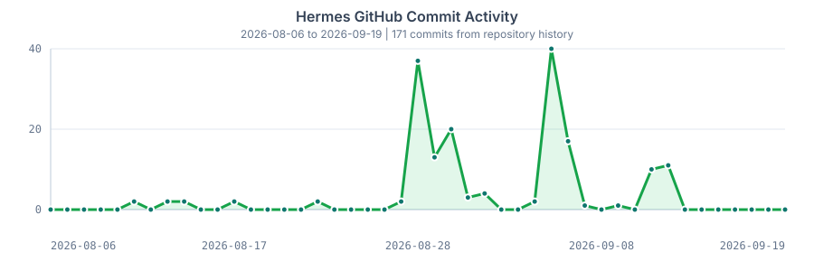
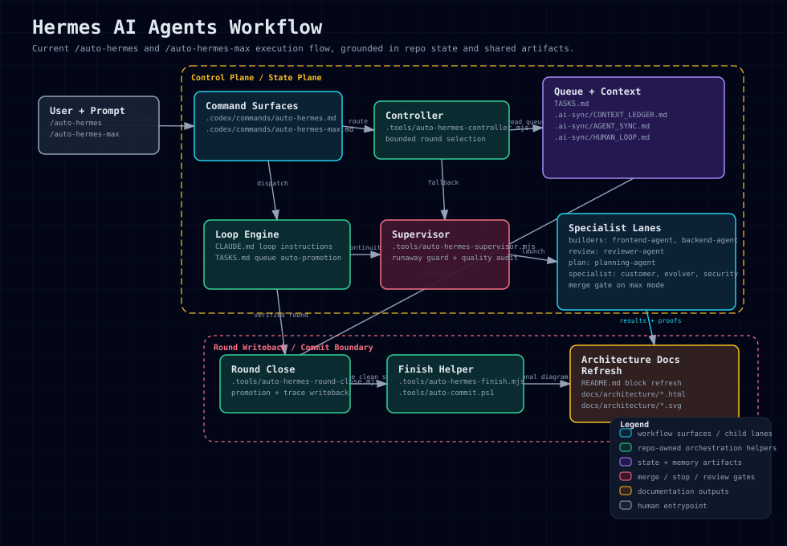
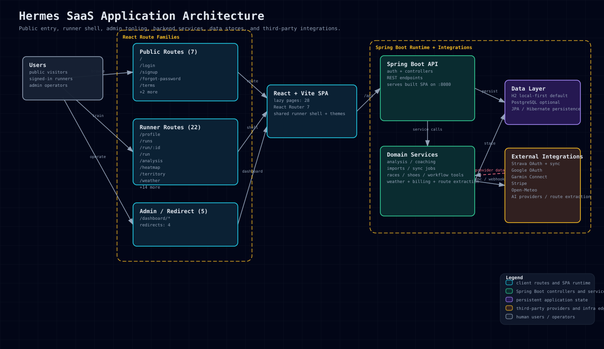
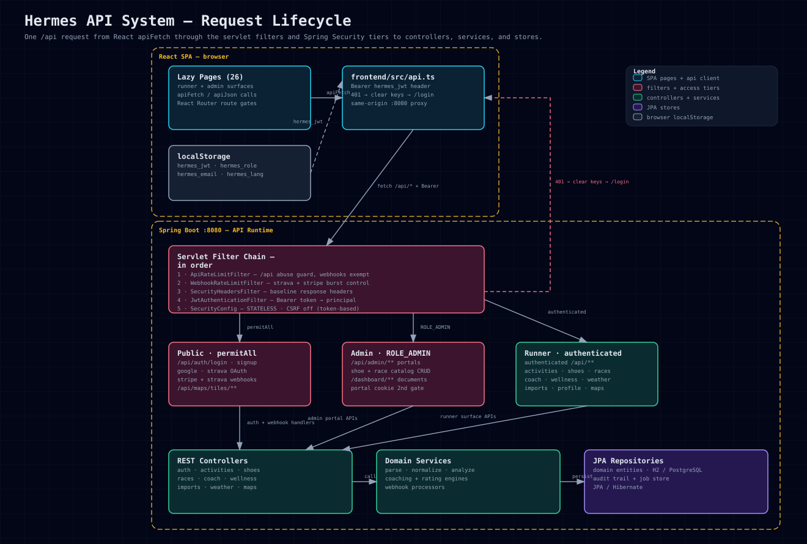
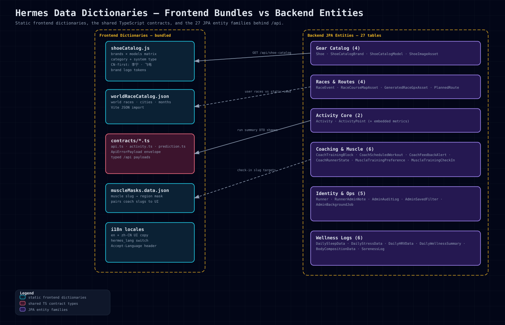

# Hermes — Your Personal Running Coach

A local-first personal running coach. **React** frontend, **Spring Boot** backend — it answers the three questions every runner asks: *should I run today and how hard, am I improving, which shoes should I use?*

📖 **[Wiki](https://github.com/JunWeiLi233/Hermesruns/wiki)** · Setup guides, architecture docs, and more.

**For developers:** [Find the files for a browser page](frontend/src/pages/README.md)
lists each URL, frontend entry, stylesheet, backend owner and feature test command.
See also the [frontend guide](frontend/README.md) and [backend package guide](docs/architecture/backend-package-migration.md).

Open [Hermes.code-workspace](Hermes.code-workspace) for separate Frontend, Backend,
Documentation and Repository Tools sections; integration setup stays in its own
section. See the [repository layout](docs/architecture/repository-layout.md).

## Activity

[](https://github.com/JunWeiLi233/Hermesruns/graphs/commit-activity)

This graph is generated from real repository commits with ISO calendar dates on the x-axis. GitHub Actions refreshes it daily and after pushes to `main`.

## What is Hermes?

Hermes is a **personal running coach** you run locally. It analyzes your running data to answer three questions:

1. **Should I run today, and how hard?** — daily readiness, weather, workout blueprint, shoe guidance
2. **Am I improving?** — VDOT tracking, training load (ACWR), race predictions, recovery estimation
3. **Which shoes should I use?** — shoe inventory, mileage tracking, AI-assisted photo scanning

Data sources: **Strava**, **Garmin Connect**, **COROS**, and manual file imports (FIT/GPX/TCX/ZIP). All analysis stays on your machine — private running intelligence for the next decision.

## Quick Start

```powershell
# Windows
.\start_hermes.bat
```

```bash
# macOS / Linux
./start_hermes.sh
```

Open `http://localhost:8080`, sign up with email, and you're in — no database setup, no API keys. More commands: [docs/repo-rules/stack-and-commands.md](docs/repo-rules/stack-and-commands.md). Production setup (PostgreSQL, OAuth, Stripe): [docs/setup.md](docs/setup.md).

## Feature Highlights

| Area | What you get |
|---|---|
| **Today Run** | Daily coaching: readiness score, weather, personalized workout blueprint, shoe recommendation |
| **Analysis** | VDOT, training paces, effort scores, ACWR injury risk, recovery time — methodology in [docs/README-ANALYSIS.md](docs/README-ANALYSIS.md) |
| **Shoes** | Inventory with mileage tracking, rotation insight, AI photo scan import, catalog browser |
| **Races / Schedule** | Interactive world map, 60+ race catalog, personal bests, countdowns; weekly training planner |
| **Heatmap / Weather** | Full-screen GPS heatmap with live totals; weather-aware coaching |
| **Coach / Rewards** | Daily coaching recommendations; achievement badges and progression |
| **Integrations** | Strava sync, Garmin Connect pull, manual FIT/GPX/TCX/ZIP import (COROS, Huawei Health) |
| **Admin** | Ops status, KPI grid, runner management, job queues, audit log |

## Web Routes

| Route | Page |
|---|---|
| `/`, `/login`, `/signup` | Landing, login, signup |
| `/profile`, `/runs`, `/run/:id` | Runner Hub, run history, run detail |
| `/analysis`, `/prediction/:distKey` | Analysis, race predictions |
| `/today-run`, `/heatmap` | Daily coaching, GPS heatmap |
| `/shoes`, `/shoe-catalog`, `/shoes/add` | Shoes, catalog, add-shoes flow |
| `/races`, `/schedule` | Race center, weekly planner |
| `/muscle-training`, `/rewards` | Muscle training, achievements |
| `/settings` | Theme, language, units, connected services |
| `/admin`, `/dashboard` | Admin login, admin dashboard |

<!-- AUTO-GENERATED ARCHITECTURE DIAGRAMS START -->
### Live Architecture Diagrams

#### AI Agents Workflow



Source artifact: [docs/architecture/ai-agents-workflow.html](docs/architecture/ai-agents-workflow.html)

#### SaaS Architecture



Source artifact: [docs/architecture/saas-architecture.html](docs/architecture/saas-architecture.html)

#### API System



Source artifact: [docs/architecture/api-system.html](docs/architecture/api-system.html)

#### Data Dictionaries



Source artifact: [docs/architecture/data-dictionaries.html](docs/architecture/data-dictionaries.html)
<!-- AUTO-GENERATED ARCHITECTURE DIAGRAMS END -->

## Documentation

- [docs/PROJECT_MAP.md](docs/PROJECT_MAP.md) — durable architecture map: directory tree, module maps, call chains
- [docs/README-DEV.md](docs/README-DEV.md) — contributor onboarding: mock account, first code change, submit/sync workflow
- [docs/README-ANALYSIS.md](docs/README-ANALYSIS.md) — analysis methodology: VDOT, training paces, ACWR, recovery formulas
- [docs/setup.md](docs/setup.md) — local & production setup, env var reference
- [docs/repo-rules/stack-and-commands.md](docs/repo-rules/stack-and-commands.md) — stack facts, core commands, coding conventions
- [docs/repo-rules/index.md](docs/repo-rules/index.md) — repo rules record system
- [docs/auto-hermes/index.md](docs/auto-hermes/index.md) — `/auto-hermes` record-system map

## Contributing

- **Task queue** — `TASKS.md` is the shared queue; pick up tasks or add new ones.
- **AI-agent workflow** — `/auto-hermes` (one bounded round) and `/auto-hermes-max` (parallel lanes with a merge gate) run from this repo; type `/` in Claude Code or Codex.
- **Submitting changes** — `/auto-hermes-push-main` is the **only supported PR path** into `main` (all gates: security scan, lint, compile, Docker, identity). See [docs/repo-rules/git-and-publish.md](docs/repo-rules/git-and-publish.md).
- **New contributors** — log in with the built-in mock account to see every feature pre-loaded with data: [docs/README-DEV.md](docs/README-DEV.md).

## 中文

→ [README.zh-CN.md](README.zh-CN.md)
